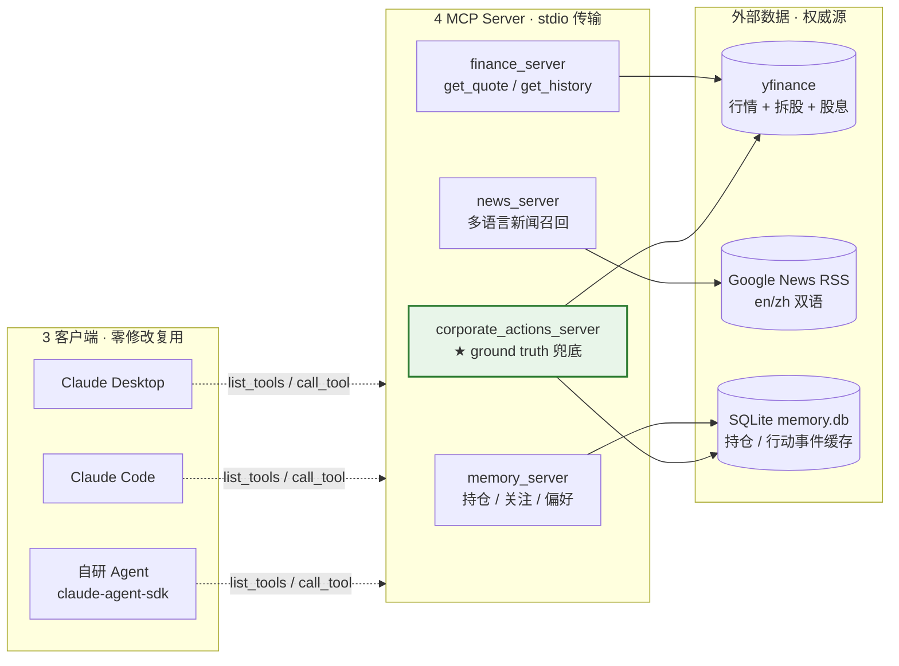

# investment-agent

> **金融垂直 MCP Agent** — 3 客户端零修改复用 · 跨 Server 拆股判别 4/4 · 24h 反例闭环

[]()
[]()
[]()
[]()

个人项目 · 对标 BOSS 直聘 Agent 工程师 JD（金融垂直 + 上下文工程 + 记忆系统）

---

## TL;DR（30 秒了解）

- **4 个 MCP Server 协作**（持仓记忆 / 行情 / 新闻 / 公司行动事件），Claude Desktop + Claude Code + 自研 Agent **三客户端零修改复用**，跨 Server 工具路由由 LLM 自主完成，**无需 orchestrator**。
- **跨 Server 拆股事件判别 4/4**（NVDA / TSLA / AAPL / 09988.HK），description A/B 实验 **10/10**。
- **反例闭环 24h** — 发现 LLM 训练知识不稳定（同日两次 session 输出 15:1 vs 3:1），设计 `corporate_actions_server` ground truth 兜底，复权后成本 $400→$80、浮盈方向 -64%→+457%。
- **W3 SDK 编排回归测试 9/9** — claude-agent-sdk + PreToolUse/PostToolUse Hook + 9 个 fixture case 全过（正样本 + 负样本）。
- **P1 Production Research Loop 已推进到 Day 5** — live tools → Source/Fact normalizer → Anthropic structured synthesis → evidence binding → guardrail → trace → 13-case regression suite。
- **方法论沉淀**：触发器 / 具体事实 / 决策建议 **三层知识分层设计模式** + **LLM hop 最小化**原则。

📍 [项目全景图与里程碑](docs/PROJECT_PANORAMA_AND_MILESTONES_CN.md) / [EN](docs/PROJECT_PANORAMA_AND_MILESTONES.md) · 📄 [一页纸 Case Study](docs/showcase/case-study-corporate-actions.md) · 💼 [简历段落](docs/showcase/resume-snippet.md) · 🧪 [P1 执行计划](docs/EXECUTION_PLAN_P1.md) · 🧠 [方法论库](docs/methodology/)

---

## 架构



完整 4 张架构图（含知识分层 / Case 时序 / 反例闭环时间线）见 [`docs/showcase/diagrams/`](docs/showcase/diagrams/)。

---

## 量化数据

| 指标 | 数据 | 来源 case |
|---|---|---|
| 跨 Server 拆股事件判别准确率 | **4/4** | NVDA / TSLA / AAPL / 09988.HK |
| description A/B 行为正确率（v0 vs v1） | **10/10** | 10 类语义陷阱 case |
| W3 SDK 编排回归测试 | **9/9** | 9 个 fixture case（含正负样本） |
| 反例闭环时长 | **24h** | 5/13 晚发现 → 5/14 当日复现 |
| Case D' 修复后工具调用次数 | 4 → **7** | 自动调用 get_corporate_actions |
| Case D' 复权后成本 | $400 → **$80** | TSLA $1200 持仓，累计 15:1 拆股 |
| Case D' 浮盈方向反转 | -64% → **+457%** | 同一持仓、同一现价 |
| 3 Server 协作终极 case | 一句话 **4 工具调用** | "持仓 TSLA + 新闻 + 价格 + 建议" |
| **W5 stateful 上下文工程**（进行中） | | |
| context window | **1M tokens**（claude-agent-sdk 默认） | Sonnet 4 |
| auto-compact 触发阈值 | **967K tokens (92%)** | SDK 内置 |
| 3 轮金融对话 messages 增长 | 5K → 7K → 10K tokens | stateful 红利的"input 永久膨胀"代价 |
| deferred tools 占比 | MCP deferred **17.7K** vs 在用 **0.9K** = 20× | 工具池规模膨胀的隐性 token 成本 |
| 累计 cost 复杂度 | **O(N²)** of 对话轮数 | 压缩策略的根因（W5 D2 实测推导） |

---

## 关键能力 · 真实 case

### Case A — 跨 Server 协作（无 orchestrator）

输入："腾讯为什么跌"
Agent 自主并取：`finance.get_quote` + `finance.get_history` + `news.get_news`，综合输出因果分析。

### Case B — 拆股事件判别 4/4

| Symbol | 实际情况 | Agent 判别 |
|---|---|---|
| NVDA | 2024-06 拆股 10:1 | ✅ 触发提醒 |
| TSLA | 2020+2022 累计 15:1 | ✅ 触发提醒（修复后稳定） |
| AAPL | 历史拆股但近期无 | ✅ 不误触发 |
| 09988.HK | 阿里 -52% 真实下跌，无拆股 | ✅ 不误触发（按真实下跌处理） |

### Case D' — 反例闭环验证

详见 [Case Study](docs/showcase/case-study-corporate-actions.md)。

---

## 项目结构

```
investment-agent/
├── src/
│   ├── mcp_servers/                  # 4 个 MCP Server
│   │   ├── memory_server.py          # 持仓 / 关注 / 偏好
│   │   ├── finance_server.py         # get_quote / get_history（含港股代码归一化）
│   │   ├── news_server.py            # Google News RSS（en/zh 双语）
│   │   └── corporate_actions_server.py  # ★ ground truth 兜底
│   ├── memory/store.py               # SQLite 持久化层
│   └── tools/                        # 工具实现
├── config/                           # portfolio / watchlist / preferences
├── experiments/                      # description A/B 实验脚手架
├── docs/
│   ├── architecture.md               # 架构设计
│   ├── methodology/                  # ★ 4 篇工程方法论沉淀（hop / 知识分层 / 跨 Server / 实验框架）
│   ├── w5-experiment-design.md       # ★ 上下文工程 4 策略实验设计
│   └── showcase/                     # 简历素材 / Case Study / ADR / 架构图集
├── .mcp.json.example                 # MCP Server 配置公开模板（脱敏路径）
└── memory.db                         # SQLite 持仓 + corporate_actions 缓存（已 gitignore）
```

---

## 快速开始

### 1. 安装

```bash
git clone <repo>
cd investment-agent
python -m venv venv && source venv/bin/activate
pip install -e .
```

### 2. 配置 Claude Desktop

把 `claude_desktop_config.json` 加上：

```json
{
  "mcpServers": {
    "investment-memory": {
      "command": "/path/to/venv/bin/python",
      "args": ["-m", "src.mcp_servers.memory_server"],
      "cwd": "/path/to/investment-agent"
    },
    "investment-finance": { "...": "..." },
    "investment-news": { "...": "..." },
    "investment-corporate-actions": { "...": "..." }
  }
}
```

完整配置模板见 [`.mcp.json.example`](.mcp.json.example)（复制为 `.mcp.json` 并替换 `<PROJECT_ROOT>` 占位符）。Claude Code 用同一格式。

### 3. 试一下

在 Claude Desktop 输入：

> 我的 TSLA 50 股 @$1200，浮盈多少？

观察 Agent 是否：
1. 调用 `get_corporate_actions("TSLA")` 拿 ground truth
2. 识别 2020-08 + 2022-08 两次拆股累计 15:1
3. 复权后成本 $80，给出 +457% 浮盈结论

### 4. 本地 CLI 连续对话

如果想绕开 Claude Desktop，直接把它当一个真实可用的本地 Agent 练习，可以启动 CLI：

```bash
cd investment-agent
source venv/bin/activate
python -m src.agents.cli_chat
```

常用命令：

```text
/context  打印当前 context usage
/help     查看命令
/exit     退出
```

建议先连续问 5-10 个真实问题，观察每轮的 tool_use、tool_result、cost 和 context token 分布。这个入口用于把 W5 context engineering 从“为了实验而实验”拉回真实使用场景。

---

## 设计文档

| 文档 | 内容 |
|---|---|
| [架构设计](docs/architecture.md) | 系统总体设计 |
| [Case Study：反例闭环](docs/showcase/case-study-corporate-actions.md) | LLM 知识不稳定 → ground truth 兜底全过程 |
| [架构图集](docs/showcase/diagrams/) | 4 张 Mermaid 架构图 |
| [ADR 决策记录](docs/showcase/adr/) | 关键工程决策与备选方案对比 |
| [方法论沉淀](docs/methodology/) | LLM hop 最小化 / 跨 Server 协作 / 知识分层 / 实验决策框架 |
| [W5 上下文工程实验设计](docs/w5-experiment-design.md) | 0/A/B/C 四策略对比，含 PreCompact hook 注入领域 instructions 杀招 |

---

## 路线图

| 阶段 | 内容 | 状态 |
|---|---|---|
| W1 MCP 基础 | memory_server + description A/B（10/10 行为正确率） | ✅ 2026-05-12 |
| W2 多 Server 协作 | finance + news + 3 Server 协作（拆股判别 4/4） | ✅ 2026-05-13（提前 11 天） |
| W2 D5 反例闭环 | corporate_actions_server + Case D' 验证 | ✅ 2026-05-14（24h 闭环） |
| W3 SDK 编排 | weekly_analyst.py + Hook 工程化 + 回归测试 9/9 | ✅ 2026-05-19 |
| W4 showcase 资产 | 简历段落 / Case Study / 4 架构图 / 5 ADR / 4 方法论 | ✅ 2026-05-20（提前 4 天） |
| W5 上下文工程 | stateful / synthetic user / context compression learning track | 🟡 历史学习线，部分完成 |
| **P1 Production Research Loop** | live tools → Source/Fact → Anthropic structured synthesis → evidence binding → guardrail → trace → regression report | ✅ Day 1-5 完成（VPS） |
| P1 Day 6 | Investment memo 输出形态 | 🔜 下一步 |
| P1 Day 7 | P1 总结文档 + 面试表达材料 | 🔜 下一步 |
| P2 Investment memory / RAG submodule | holdings / watchlist / filings / notes / RAG schema | 🔲 规划中 |
| P3 Retrieval-to-Evidence | RAG retrieval → Source/Fact → memo-grade research | 🔲 规划中 |

---

## 工程方法论沉淀

完整方法论库见 [`docs/methodology/`](docs/methodology/)。核心 4 条：

- [LLM hop 最小化原则](docs/methodology/llm-hop-minimization.md)：关键事实必须 hop=0，模糊判断 hop>0 OK
- [知识分层设计模式](docs/methodology/architecture.md)：触发器 / 具体事实 / 决策建议三层
- [跨 Server 无 orchestrator 模式](docs/methodology/cross-server-cases.md)：LLM 自主编排工具调用顺序
- [实验决策框架](docs/methodology/experiment-decision-framework.md)：推理 vs 实测的 3 维 ROI 评分矩阵

---

## License

MIT
