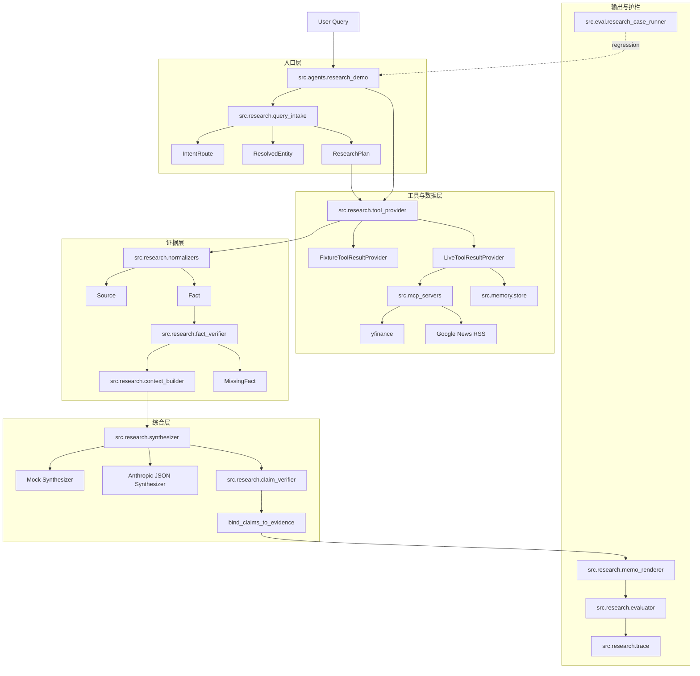

# 程序员视角项目全景图

最后更新：2026-06-11

这份文档是给“接手代码的人”看的项目全景图。它不替代 `README.md` 和 `docs/PROJECT_PANORAMA_AND_MILESTONES_CN.md`：前者偏项目介绍，后者偏里程碑和产品方向；本文偏代码地图、运行链路和改动入口。

## 程序员全景图怎么做

程序员的全景图不是把目录树截图，也不是把所有文件平均讲一遍。好的全景图通常按这几个问题组织：

1. 用户从哪里进来？
2. 请求沿着哪条主路径流动？
3. 哪些对象是系统的稳定契约？
4. 哪些模块只做确定性工作，哪些模块允许 LLM 参与？
5. 失败、缺证据、越界建议在哪里被挡住？
6. 我要改一个能力时，应该先改哪几个文件、跑哪几类测试？

这个项目的核心答案是：

```text
User Query
 -> Query Intake / Route / Entity / Plan
 -> Tool Provider
 -> Source / Fact Normalizer
 -> Verified Fact Table + Missing Facts
 -> Research Context
 -> LLM / Mock Synthesizer
 -> Claim Verification + Evidence Binding
 -> Memo Renderer
 -> Guardrail Evaluator
 -> Trace / Regression
```

## 一张总图



## 当前代码的主心智模型

本项目是一个投资研究 Agent，但代码的主线不是“让模型自由回答股票问题”，而是“让每个研究结论都能追溯到证据”。

稳定契约在 `src.research.models`：

| 对象 | 作用 |
|---|---|
| `Source` | 信息来自哪里，例如 live tool、fixture、用户记忆、外部 URL |
| `Fact` | 从来源中抽出的可推理事实 |
| `VerifiedFact` | 已核验、可放进 LLM context 的事实 |
| `MissingFact` | 显式记录缺失证据，防止模型用缺口编结论 |
| `ResearchContext` | 给 synthesizer 的最小上下文，只暴露可引用事实和约束 |
| `Claim` / `Evidence` | 研究结论和它引用的事实、来源 |
| `GuardrailResult` | 输出后的安全与质量检查结果 |
| `ResearchRunState` | 单次研究 run 的完整审计状态 |

核心设计原则是：`Source -> Fact -> VerifiedFact / MissingFact -> ResearchContext -> Claim -> Evidence -> Memo -> Guardrail -> Trace`。

## 运行入口

主要入口是 `src/agents/research_demo.py`。

常用路径：

```bash
python -m src.agents.research_demo --query "帮我看 TSLA 最近是否还值得继续关注。" --data-source fixture
```

安装为包后也可以走脚本入口：

```bash
investment-research --query "帮我看 TSLA 最近是否还值得继续关注。" --data-source fixture
```

入口层做三件事：

1. `understand_query()` 解析用户问题、标的、意图、时间窗口和研究计划。
2. `make_tool_provider()` 选择 fixture 或 live 数据源。
3. `build_research_run_from_bundle()` 把工具结果推进完整研究链路。

## 主链路拆解

### 1. 用户问题理解

关键文件：

- `src/research/query_intake.py`
- `src/research/time_window.py`
- `src/research/attribution_planner.py`
- `src/research/retrieval_planner.py`

产物：

- `QueryIntake`
- `IntentRoute`
- `ResolvedEntity`
- `ResearchPlan`
- `TimeWindow`
- `AttributionPlan`

这里决定“用户到底是在问研究问题、归因问题、估值问题、组合问题，还是直接交易建议”。直接交易建议会被路由到边界回答，而不是给出买卖指令。

### 2. 工具结果获取

关键文件：

- `src/research/tool_provider.py`
- `src/mcp_servers/finance_server.py`
- `src/mcp_servers/news_server.py`
- `src/mcp_servers/corporate_actions_server.py`
- `src/mcp_servers/memory_server.py`
- `src/memory/store.py`

`FixtureToolResultProvider` 用于确定性测试，`LiveToolResultProvider` 复用 MCP server 后端函数获取真实 quote、history、news、corporate actions 和用户偏好。

live provider 的重要特性是单工具失败隔离：某个工具失败会变成结构化 error，再被 normalizer 转成 failure fact，而不是让整轮研究崩掉或偷偷回退成假数据。

### 3. Source / Fact 归一化

关键文件：

- `src/research/normalizers.py`
- `src/research/fact_verifier.py`
- `src/research/context_builder.py`

工具原始输出不会直接喂给 LLM，而是先转成：

- `Source`：来源、工具名、抓取时间、可靠性；
- `Fact`：可推理文本、metric、value、symbol、observed_at；
- `VerifiedFact`：进入 LLM context 的事实；
- `MissingFact`：必须显式暴露的证据缺口。

数据质量也在这里进入事实系统，例如：

- quote 过期；
- news 缺失；
- 价格走势与新闻信号冲突；
- 工具调用失败。

### 4. LLM 综合与证据绑定

关键文件：

- `src/research/synthesizer.py`
- `src/research/claim_verifier.py`

当前有两个 synthesizer：

- `MockLLMResearchSynthesizer`：离线、确定性、适合测试；
- `AnthropicJSONResearchSynthesizer`：真实 LLM，要求 `ANTHROPIC_API_KEY` 和网络访问。

LLM 只能返回结构化 `CandidateClaim`，并且每条 claim 必须带 `fact_ids`。随后：

1. `verify_synthesis_claims()` 检查是否引用不存在的 fact、是否用缺失事实当支撑、是否出现直接交易建议等。
2. `filter_synthesis_to_verified_claims()` 过滤不可接受的 claim。
3. `bind_claims_to_evidence()` 把 claim 绑定回 `Fact` 和 `Source`。

也就是说，LLM 可以“组织语言和归纳”，但不能凭空新增事实。

### 5. Memo、Guardrail、Trace

关键文件：

- `src/research/memo_renderer.py`
- `src/research/evaluator.py`
- `src/research/trace.py`
- `src/research/trace_viewer.py`

`memo_renderer` 负责生成用户可读研究 memo。`evaluator` 负责输出后检查：

- 不包含直接买入、卖出、加仓、减仓、清仓、做空、持有等交易指令；
- key claim 必须有 evidence；
- evidence source 必须有时间戳；
- 输出必须提及来源、时效、风险或未知；
- 输出必须包含人工确认点。

`TraceLogger` 把关键阶段写进 run trace，方便回放和回归。

## 目录地图

```text
src/
├── agents/
│   ├── research_demo.py          # 当前 Production Research Loop 主入口
│   ├── cli_chat.py               # 本地连续对话入口
│   ├── regression_runner.py      # 辅助回归运行
│   └── stateful_assistant.py     # 长上下文/状态化实验入口
├── research/
│   ├── models.py                 # 核心领域模型和 run state
│   ├── query_intake.py           # 用户问题理解
│   ├── tool_provider.py          # fixture/live 工具结果包
│   ├── normalizers.py            # 工具输出 -> Source/Fact
│   ├── fact_verifier.py          # VerifiedFact/MissingFact
│   ├── context_builder.py        # ResearchContext
│   ├── synthesizer.py            # mock/Anthropic 结构化综合
│   ├── claim_verifier.py         # claim 证据核验
│   ├── memo_renderer.py          # memo 输出
│   ├── evaluator.py              # guardrail
│   ├── trace.py                  # trace 写入
│   └── *_test.py                 # 研究链路单元测试
├── mcp_servers/
│   ├── memory_server.py          # 用户记忆、持仓、偏好
│   ├── finance_server.py         # quote/history
│   ├── news_server.py            # news
│   └── corporate_actions_server.py # split/dividend ground truth
├── eval/
│   ├── research_case_runner.py   # 研究边界和数据质量 case runner
│   └── probe_scorer.py           # 压缩/探针评估辅助
└── memory/
    └── store.py                  # SQLite/local config 记忆层
```

## 修改能力时从哪里下手

| 想改的能力 | 优先看这些文件 |
|---|---|
| 新增一种用户问题类型 | `query_intake.py`, `models.py`, `memo_renderer.py`, `research_case_runner.py` |
| 新增数据源或工具 | `tool_provider.py`, `mcp_servers/`, `normalizers.py` |
| 新增事实类型 | `models.py`, `normalizers.py`, `fact_verifier.py`, `context_builder.py` |
| 改 LLM 输出约束 | `synthesizer.py`, `claim_verifier.py`, `context_builder.py` |
| 改 memo 章节 | `memo_renderer.py`, `evaluator.py`, `research_case_runner.py` |
| 改安全边界 | `evaluator.py`, `claim_verifier.py`, `query_intake.py` |
| 加回归案例 | `src/eval/research_case_runner.py`, 对应 `test_*.py` |
| 看一次 run 的审计过程 | `trace.py`, `trace_viewer.py` |

## 测试与回归护栏

建议最小验证顺序：

```bash
pytest src/research src/eval
python -m src.agents.research_demo --query "帮我看 TSLA 最近是否还值得继续关注。" --data-source fixture
python -m src.eval.research_case_runner
```

测试层重点不是预测投资表现，而是验证工程边界：

- 是否拒绝直接交易建议；
- 是否每个关键结论都有证据；
- 是否展示来源和时间戳；
- 是否把 stale/missing/conflict 数据质量问题显式说出来；
- 是否保留人工确认点；
- 是否能在 fixture 下确定性复现。

## 当前项目状态判断

这个仓库已经具备一个可运行的 P1 研究闭环：

- 有入口；
- 有 live/fixture 双数据源；
- 有 Source/Fact/Claim/Evidence 模型；
- 有证据绑定；
- 有 guardrail；
- 有 memo renderer；
- 有 trace；
- 有 regression case。

但它还不是完整投资研究平台。后续主要缺口是：

- 更丰富的 deterministic data analysis layer，例如估值、波动、回撤、相关性、组合暴露；
- RAG/文档库进入 `Source -> Fact` 链路；
- 监控事件自动触发 research run；
- 更强的 citation/evidence quality eval；
- 更完整的 portfolio/risk memory。

## 给新接手者的阅读顺序

1. 先读 `src/agents/research_demo.py`，理解一轮 run 怎么被串起来。
2. 再读 `src/research/models.py`，把核心数据对象记住。
3. 看 `src/research/tool_provider.py` 和 `src/research/normalizers.py`，理解原始数据如何变成证据。
4. 看 `src/research/synthesizer.py` 和 `src/research/claim_verifier.py`，理解 LLM 被限制在哪里。
5. 看 `src/research/memo_renderer.py` 和 `src/research/evaluator.py`，理解最终输出和安全边界。
6. 最后看 `src/eval/research_case_runner.py`，理解这个项目真正要守住哪些行为。

如果只记一句话：这个项目的工程价值在于把投资研究回答拆成可追踪的生产链路，而不是让 LLM 直接对股票发表看法。
