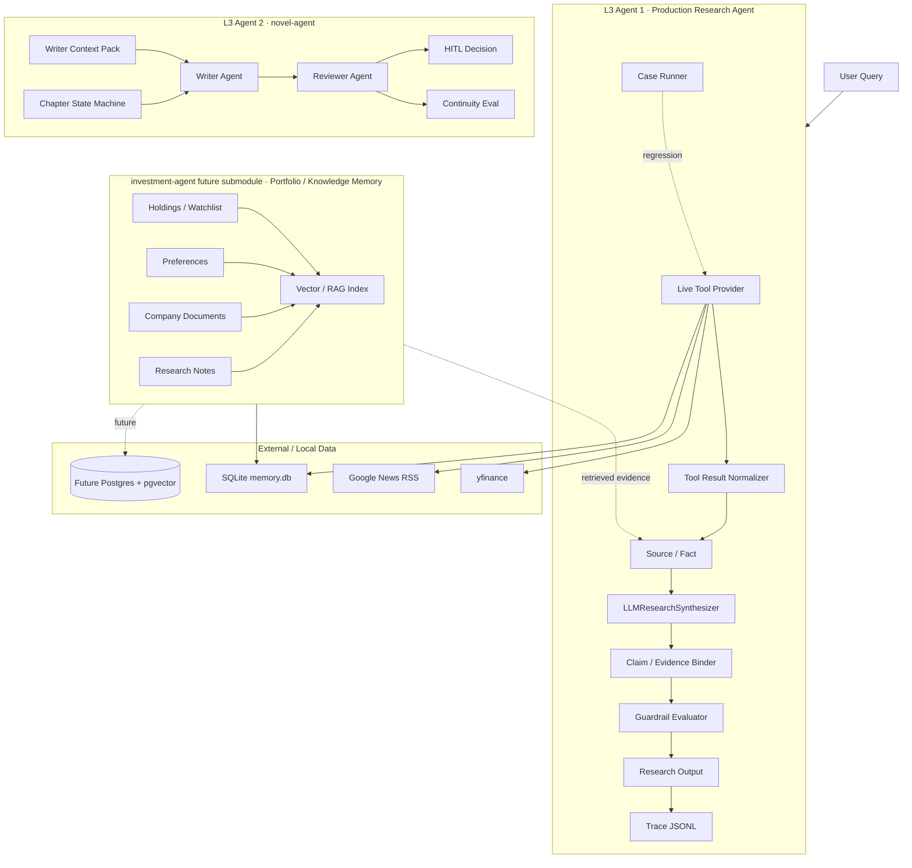

# Project Panorama and Milestones

Last updated: 2026-06-04
Source of truth for current cloud progress: VPS repo history and `docs/EXECUTION_PLAN_P1.md`.

## Why This Project Exists

`investment-agent` is a learning and portfolio project for building a production-shaped vertical AI agent in finance. The goal is not to produce trading advice. The goal is to demonstrate how a domain agent can:

- fetch live and historical market context through tools,
- convert messy tool output into traceable evidence,
- constrain LLM synthesis to sourced facts,
- bind every important claim back to evidence,
- run guardrails before presenting research output,
- preserve traces and regression cases for repeatable evaluation,
- evolve toward portfolio memory and RAG without losing provenance.

The learning path is intentionally engineering-first: every capability should expose a failure mode, add a boundary, and produce a reusable artifact.

## Two L3 Agent Tracks

The learning roadmap has two separate L3 agent projects. They are intentionally different so they train different production problems.

### L3 Agent 1: investment-agent / Production Research Agent

Purpose: answer a user research query with a traceable, guardrailed research output.

Core loop:

```text
User Query
 -> Live Tool Provider
 -> Tool Result Normalizer
 -> Source / Fact
 -> LLMResearchSynthesizer
 -> Claim / Evidence Binder
 -> Guardrail Evaluator
 -> Research Output
 -> Trace JSONL
 -> Case Runner / Regression Report
```

Current status: P1 Day 1-6 completed on the VPS.

### L3 Agent 2: novel-agent / Long-Context Creative Agent

Purpose: produce and revise long-form fiction with durable story state, writer/reviewer separation, continuity checks, and human approval.

Planned responsibilities:

- writer context pack,
- chapter state machine,
- writer agent and reviewer agent,
- review artifacts with evidence from canon/context,
- rewriter loop,
- HITL decisions for accept / revise / regenerate,
- continuity evaluation for character, plot, timeline, foreshadowing, and style.

Current status: separate contrast project outside this repo. It should remain the creative/long-context counterweight to `investment-agent`, not be renamed into an investment memory subsystem.

### investment-agent Future Submodule: Portfolio / Knowledge Memory

This is not the second L3 agent. It is a future submodule inside `investment-agent` that will support research memory and RAG.

Planned responsibilities:

- holdings and watchlist state,
- user investment preferences,
- company profiles and filings metadata,
- annual reports / transcripts / research notes,
- thesis and anti-thesis records,
- valuation assumptions,
- document chunks and embeddings for RAG,
- retrieval results that can be converted into `Source` and `Fact` rather than pasted into prompts as untracked text.

Current status: concept and existing SQLite/config foundation only. Full RAG ingestion and retrieval are not implemented yet.

## System Panorama



## Current Evidence Model

The common contract for both L3 tracks is:

```text
Source = where information came from
Fact = what usable evidence was extracted
Claim = what the synthesizer says based on facts
Evidence = verified link from claim to fact/source
Guardrail = post-generation safety and quality check
Trace = replayable JSONL audit trail
```

This matters because future RAG should not bypass the research loop. Retrieved chunks should become `Source` / `Fact` first, then be used by the synthesizer and guardrail system.


## investment-agent Production Module Map

This mirrors the `novel-agent` production map format: `✅` means the module exists and is runnable; `🟡` means a useful slice exists but not the production version; `🔲` means the module is still only a planned capability.

```text
+----------------------------------------------------------------------------+
|              investment-agent production research agent map                 |
|                  ✅ exists | 🟡 partial | 🔲 missing       |
+----------------------------------------------------------------------------+

+------------------------------+  +------------------------------+
| 1. Research Loop             |  | 2. Tools / Data              |
+------------------------------+  +------------------------------+
| ✅ research_demo         |  | ✅ memory_server          |
| ✅ RunState / models     |  | ✅ finance_server         |
| ✅ Source / Fact         |  | ✅ news_server            |
| ✅ Claim / Evidence      |  | ✅ corporate_actions      |
| 🟡 Intent Router     P1  |  | 🟡 live failure guard P1  |
| 🟡 Planner           P1  |  | 🔲 tool budget        P1  |
| 🟡 Runtime recovery  P1  |  | 🔲 provider registry  P2  |
+------------------------------+  +------------------------------+

+------------------------------+  +------------------------------+
| 3. Evidence / Source          |  | 4. LLM Synthesizer            |
+------------------------------+  +------------------------------+
| ✅ Source model          |  | ✅ Mock synthesizer        |
| ✅ Fact model            |  | ✅ Anthropic structured    |
| ✅ Evidence binder       |  | ✅ Claim schema            |
| ✅ timestamps            |  | 🟡 prompt policy       P1  |
| 🟡 reliability model P1  |  | 🟡 invalid claim repair P1 |
| 🟡 citation surface  P1  |  | 🔲 model routing       P2  |
| 🔲 external URLs     P2  |  | 🔲 cost/latency policy P2  |
+------------------------------+  +------------------------------+

+------------------------------+  +------------------------------+
| 5. Guardrail / Policy         |  | 6. Eval / Regression          |
+------------------------------+  +------------------------------+
| ✅ no trading advice     |  | ✅ 10 boundary cases       |
| ✅ evidence required     |  | ✅ 3 data-quality cases    |
| ✅ timestamp required    |  | ✅ json-report records     |
| ✅ risk/unknown required |  | 🟡 trace assertions    P1  |
| 🟡 freshness rules   P1  |  | 🟡 live failure cases  P1  |
| 🟡 conflict rules    P1  |  | 🔲 LLM invalid-id case P1  |
| 🔲 repair/degrade    P1  |  | 🔲 citation eval       P2  |
+------------------------------+  +------------------------------+

+------------------------------+  +------------------------------+
| 7. Output / HITL              |  | 8. Memory / RAG               |
+------------------------------+  +------------------------------+
| ✅ research snapshot     |  | ✅ SQLite memory.db        |
| ✅ human questions       |  | ✅ config portfolio/watch  |
| ✅ memo sections     P1  |  | 🟡 preferences memory  P1  |
| 🟡 investment memo   P1  |  | 🔲 filings metadata    P2  |
| ✅ evidence table    P1  |  | 🔲 document ingestion  P2  |
| 🔲 approval gates    P1  |  | 🔲 embeddings/pgvector P2  |
| 🔲 decision log      P2  |  | 🔲 retrieval->Fact     P2  |
+------------------------------+  +------------------------------+

P0 main path: Research Boundary -> Source/Fact -> Synthesizer -> Evidence Binder -> Guardrail -> Trace
P1 quality loop: Case Runner -> Freshness/Missing/Conflict -> Degradation -> Trace-to-Eval
P2 research depth: Investment Memo -> Portfolio/Knowledge Memory -> RAG Retrieval -> Citation-rich Memo
```

### Current Completion Heatmap

```text
✅ Done:
  ResearchRunState / Source / Fact / Claim / Evidence
  Tool Result Normalizer / Live Tool Provider / corporate_actions ground truth
  Mock + Anthropic structured synthesizers
  Evidence Binder / Guardrail Evaluator / Trace JSONL
  Research Snapshot renderer / Investment Memo renderer / Evidence Table
  10 boundary cases + 3 frozen data-quality cases

🟡 Partial:
  Intent Router / Planner / Runtime recovery
  tool failure handling / freshness rules / conflict rules
  source reliability / citation surface
  prompt policy / invalid claim filtering
  HITL as questions only, not approval gates
  preferences and SQLite memory foundation

🔲 Missing:
  explicit Tool Budget / Provider Registry / Degradation policy
  richer trace assertions / live failure regression cases
  external URL citations and provider reliability matrix
  annual reports / filings / transcripts ingestion
  embeddings / pgvector / retrieval-to-Source-Fact bridge
  model routing / cost and latency policy
  decision log and explicit HITL approval gates
```

### Phase Roadmap

```text
P0 - Traceable investment research core
  1. Boundary document
  2. ResearchRunState + Source/Fact/Claim/Evidence
  3. Trace JSONL
  4. Guardrail evaluator
  5. Demo research output
  Status: ✅ Done via P1 Day 1-3

P1 - Regression and data-quality control
  1. Case Runner boundary suite
  2. Anthropic structured outputs
  3. stale/missing/conflict facts
  4. frozen data-quality cases
  5. trace-to-eval records
  6. memo trace event assertion
  Status: 🟡 Partial / ✅ Done via P1 Day 4-6; remaining live failure cases and richer trace assertions

P2 - Memo-grade research experience
  1. Investment Memo renderer
  2. evidence table and freshness notes
  3. richer citation surface
  4. explicit HITL gates
  5. decision log
  Status: 🟡 Day 6 completed memo shape; P2 still needs richer citations, explicit HITL gates, and RAG-backed memo

P3 - Portfolio memory and RAG
  1. holdings/watchlist/preference schema hardening
  2. filings / annual reports / transcripts metadata
  3. document chunking and embeddings
  4. retrieval-to-Source/Fact bridge
  5. memo-grade company research with citations
  Status: 🔲 Planned
```

## Milestones

| Phase | Milestone | Actual Status |
|---|---|---|
| W1 | MCP foundation: memory server + description A/B | Completed |
| W2 | Multi-server collaboration: finance + news + split detection | Completed |
| W2 D5 | Corporate actions ground-truth fallback and 24h counterexample loop | Completed |
| W3 | SDK orchestration and regression harness | Completed |
| W4 | Showcase assets: case study, ADRs, diagrams, resume snippets | Completed |
| W5 | Stateful/context engineering experiments | Partially completed / historical learning track |
| P1 Day 1 | VPS fixture/live mock acceptance | Completed |
| P1 Day 2 | Tool Result Normalizer extracted | Completed, commit `ba3d69a` |
| P1 Day 3 | Live + Anthropic structured synthesis | Completed, commit `ff34aa4` |
| P1 Day 4 | Case Runner expanded to 10 boundary cases | Completed, commit `c2eac74` |
| P1 Day 5 | Freshness / missing data / conflict / unknown minimal rules | Completed, commit `59d398a` |
| P1 Day 6 | Investment memo output shape | Completed, commit `e269555` |
| P1 Day 7 | P1 summary docs + interview explanation material | In progress, bilingual docs `docs/P1_FINAL_NARRATIVE.md` / `docs/P1_FINAL_NARRATIVE_CN.md` |
| P2 | investment-agent portfolio / knowledge memory submodule schema and RAG ingestion plan | Planned |
| P3 | Retrieval-to-Source/Fact integration and memo-grade company research | Planned |
| novel-agent P0 | Writer context pack + chapter state machine | Planned in separate repo |
| novel-agent P1 | Writer / reviewer / rewriter + HITL + continuity eval | Planned in separate repo |


## Production Gap Backlog From The Older L3 Map

The older L3 production gap map is still valid. P1 Day 1-5 implemented the traceable investment-research core, but it did not finish every production module.

| Production Module | investment-agent Current Status | Remaining Gap | novel-agent Counterpart |
|---|---|---|---|
| Intent Router | Not explicit | classify research vs advice vs portfolio/memo/data request | classify plan/write/review/rewrite/HITL intent |
| Planner | Mostly implicit | explicit plan/tool budget for multi-step research | chapter plan and rewrite plan |
| Orchestrator / Runtime | Lightweight `research_demo.py` | stronger run lifecycle and recovery | chapter workflow runtime |
| Tool Registry / Tool Schema | Partial | stricter tool input/output schemas and validation | operation registry for chapter actions |
| Tool Executor | Partial | retry, timeout, cache, degradation policy | operation retry/recover for generation steps |
| Context Builder / Context Pack | Partial via facts | memo context builder and retrieval pack | writer context pack |
| Memory / State | SQLite/config foundation | holdings/watchlist/filings/notes/RAG state | chapter/story/canon state |
| Source Verification / Citation | Implemented core Source/Fact/Evidence | richer provider reliability and citation surfaces | story canon verification |
| Policy / Guardrail | Implemented minimal evaluator | richer policy matrix and repair/degrade flow | style/canon/pacing policy |
| HITL | Output asks questions | explicit approval gates for high-impact conclusions | accept/revise/regenerate decisions |
| Trace Logger | Implemented JSONL trace | richer trace assertions and failure capture | chapter run trace |
| Eval / Regression | 13 cases now | broader live failure cases and citation checks | continuity/golden chapter eval |
| Model Routing | Not implemented | model selection by task/risk/cost | writer/reviewer model split |

Keep this backlog visible. Do not collapse it into the Day 6/Day 7 plan; those are only the next P1 steps, not the full L3 production target.

## Current P1 Verification Snapshot

Latest recorded VPS verification from Day 6:

```bash
.venv/bin/ruff check src/agents/research_demo.py src/research/*.py src/eval/research_case_runner.py
.venv/bin/python -m pytest
.venv/bin/python -m src.eval.research_case_runner --data-source fixture --synthesizer mock --suite all
.venv/bin/python -m src.eval.research_case_runner --data-source live --synthesizer mock --suite boundary
```

Observed:

- `pytest`: 18 passed.
- fixture + mock all suite: 13/13 PASS, with `memo_trace=True` for every case.
- live + mock boundary suite: 10/10 PASS, with `memo_trace=True` for every case.
- fixture + mock demo: Investment Research Memo rendered, Guardrail PASS.
- live + anthropic was previously validated on Day 3 with Guardrail PASS.

## What Is Done vs Not Done

Done:

- Live tool bundle fetch path.
- Tool result normalization into stable `Source` / `Fact` objects.
- Anthropic structured-output synthesizer.
- Evidence binding from claims to facts/sources.
- Rule-based guardrail evaluator.
- Trace JSONL writing.
- Boundary regression suite with 10 cases.
- Frozen data-quality suite with 3 cases.
- Minimal stale quote, missing news, and conflict facts.

Not done yet:

- Durable company research document store.
- Annual report / filing ingestion.
- Embedding and pgvector retrieval.
- Retrieval-to-Source/Fact bridge.
- Explicit intent router, planner, tool budget, and degradation policy.
- HITL approval gates beyond rendered confirmation questions.
- Model routing.
- Rich conflict detection across independent providers.
- Live failure regression cases from observed production-like runs.
- Interview-ready P1 final narrative. Day 7 in progress.


## Delivery Timeline and Resume Readiness

Use this schedule as the weekly check-in baseline. At the start of each work session, compare actual progress against these dates and mark whether the project is ahead, on track, or delayed.

| Date | Milestone | Expected Output | Resume Readiness |
|---|---|---|---|
| 2026-06-04 Thu | P1 Day 6: Investment Memo output shape | memo renderer, evidence table, freshness notes, unknowns/conflicts, trace reference | Completed, commit `e269555` |
| 2026-06-05 Fri | P1 Day 7: P1 summary and interview material | P1 summary doc, architecture explanation, 3-minute pitch, resume bullets | Close to v1 |
| 2026-06-06 Sat | Resume package v1 cleanup | README/showcase/resume snippet updated, final demo commands verified | Ready for final review |
| 2026-06-07 Sun | First application batch | Apply to first Agent / AI application roles with P1 story | Start applying v1 |
| 2026-06-08 to 2026-06-12 | P2 memory/RAG schema | holdings, watchlist, filings, research notes, thesis/anti-thesis schema | Strengthening during applications |
| 2026-06-13 to 2026-06-16 | RAG ingestion and retrieval-to-Source/Fact | documents/chunks/metadata and retrieval outputs converted into Source/Fact | Stronger technical depth |
| 2026-06-17 to 2026-06-20 | Memo-grade company research | citation-rich company memo, richer eval, failure regression cases | Stronger production-grade version |
| Around 2026-06-21 | Production-grade v2 checkpoint | P1 + P2 integrated narrative and demo | Stronger interview-ready version |

### Readiness Definition

- **Application v1 readiness**: P1 loop is stable, Day 6 memo shape exists, Day 7 explanation material is ready, and the README/showcase can tell the traceable research-agent story clearly.
- **Production-grade v2 readiness**: the research loop can use durable portfolio/company knowledge, retrieved materials become Source/Fact evidence, and memo-grade output has richer citation and regression coverage.

### Schedule Check Rule

At each new task session, answer:

1. Are we ahead, on track, or delayed relative to the table above?
2. What milestone is currently blocking resume v1 or production-grade v2?
3. Did the latest code change add a trace, guardrail, eval, memo, or memory/RAG capability?

## Next Work

### Day 6: Investment Memo Output Shape

Status: completed, commit `e269555`.

Goal: convert the current research snapshot into a memo-shaped output without turning it into trading advice.

Expected sections:

- Boundary Statement
- Executive Summary
- Evidence Table
- What We Know
- Risks
- Unknowns / Conflicts
- Freshness Notes
- User Preference Fit
- Human Confirmation Points
- Trace Reference

### Day 7: P1 Final Narrative

Goal: produce human-facing materials that explain the production research loop and why each boundary exists.

Expected artifacts:

- P1 summary document,
- updated architecture diagram,
- interview explanation for Source / Fact / Claim / Evidence / Guardrail,
- resume/showcase deltas,
- next-phase RAG plan.

## Reading Order For New Codex Sessions On VPS

1. `docs/PROJECT_PANORAMA_AND_MILESTONES.md`
2. `docs/P1_FINAL_NARRATIVE_CN.md`
3. `docs/P1_FINAL_NARRATIVE.md`
4. `docs/EXECUTION_PLAN_P1.md`
5. `docs/RESEARCH_CASE_EVAL.md`
6. `src/agents/research_demo.py`
7. `src/research/models.py`
8. `src/research/normalizers.py`
9. `src/research/synthesizer.py`
10. `src/research/evaluator.py`
11. `src/eval/research_case_runner.py`
