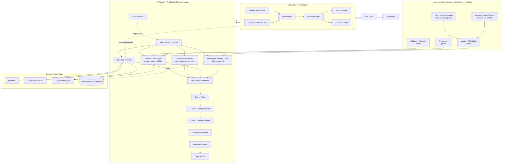

# 项目全景图与里程碑

最后更新：2026-06-06
当前项目进度的主事实来源：本文档。其他文档用于辅助说明、阶段执行记录或具体方案展开。

## 这个项目为什么存在

`investment-agent` 是一个用于学习和展示的金融垂直 AI Agent 项目，目标是把一个 Agent 做成更接近生产系统的形态。它不是交易顾问，也不应该直接给出买入、卖出、加仓、清仓、持有、做空等操作建议。

这个项目真正要证明的是：一个金融研究 Agent 可以如何做到：

- 通过工具获取实时和历史市场上下文；
- 把杂乱的工具输出转成可追踪的证据；
- 约束 LLM 只能基于有来源的事实做归纳；
- 把每个关键结论绑定回证据；
- 在输出前通过 guardrail 做质量和安全检查；
- 保存 trace 和 regression case，支持可重复评估；
- 在不丢失 provenance 的前提下，逐步演进到组合记忆和 RAG。

这条学习路线是工程优先的：每加一个能力，都应该暴露一个失败模式、增加一条边界，并沉淀成可复用的产物。

## 两条 L3 Agent 主线

当前学习路线包含两个独立的 L3 Agent 项目。它们故意选择不同的问题域，用来训练不同的生产化能力。

### L3 Agent 1：investment-agent / Production Research Agent

目标：回答用户的投资研究问题，并生成可追踪、带 guardrail 的研究输出。

核心链路：

```text
User Query
 -> Live Tool Provider
 -> Tool Result Normalizer
 -> Source / Fact
 -> LLMResearchSynthesizer
 -> Claim / Evidence Binder
 -> Guardrail Evaluator
 -> Investment Memo
 -> Trace JSONL
 -> Case Runner / Regression Report
```

当前状态：VPS 上已经完成 P1 Day 1-7。P1 Production Research Loop 已形成可运行、可解释、可面试讲述的 v1；后续 P2/P3/P4/P5 都应继续服从同一条 `Source -> Fact -> Claim -> Evidence -> Guardrail -> Memo -> Trace / Eval` 主链路。

### L3 Agent 2：novel-agent / Long-Context Creative Agent

目标：生成和修改长篇小说，重点是稳定的故事状态、writer/reviewer 分离、连续性检查，以及人工确认流程。

计划职责：

- writer context pack；
- chapter state machine；
- writer agent 与 reviewer agent；
- reviewer 基于 canon/context 给出有证据的 review artifact；
- rewriter loop；
- accept / revise / regenerate 的 HITL 决策；
- 针对角色、情节、时间线、伏笔、风格的 continuity eval。

当前状态：这是另一个独立对照项目，不在本仓库内。它应该保持为创作密集、长上下文方向的 L3 Agent，不应被重命名成投资记忆子系统。

### investment-agent 生产子模块：研究核心 + 数据事实 + 组合风险 + 知识记忆 + 监控触发

这不是第二个 L3 Agent，也不是要把项目改成一组互相聊天的多 Agent 团队。`investment-agent` 的主线仍然是一个 Production Research Agent；未来新增能力都应该服从同一条生产链路：

```text
Tool / Data / Memory / Alert
 -> Source
 -> Fact
 -> Claim
 -> Evidence
 -> Guardrail
 -> Memo
 -> Trace / Eval
```

也就是说，外部优秀项目里值得吸收的 Research、Data Analysis、Portfolio、Risk、Monitor、Explainability 理念，都应该先落成当前研究核心的事实生产器、风险事实层、触发入口、输出形态或 evaluator，而不是直接另建一个 Agent。

计划职责：

- **Research Core**：把用户问题、工具结果、证据、guardrail、memo、trace 和 regression 串成可回放研究链路；
- **Data Analysis Layer**：估值倍数、回撤、波动率、相关性、因子排序、组合表现、压力测试等确定性计算，计算结果必须转成 `Fact`；
- **Portfolio / Risk Layer**：持仓、watchlist、用户偏好、集中度、行业/资产暴露、回撤风险、情景影响，用于生成风险事实，而不是交易指令；
- **Knowledge Memory / RAG**：公司 profile、filings metadata、年报、电话会 transcript、研究笔记、thesis / anti-thesis、valuation assumptions；
- **Monitor / Alert Trigger**：财报、价格异动、估值区间、新闻异常、宏观事件等触发 research run 或 mini memo，不直接触发买卖建议；
- **Explainability Surface**：结论置信度、关键假设、反方观点、推翻条件、证据表、freshness/unknown/conflict 展示。

当前状态：Research Core 已有 P1 可运行切片；Portfolio / Risk 有 SQLite/config 基础；Explainability 已通过 memo renderer 和 evidence table 有可运行切片。P2 已开始形成手动公司研究和原则库辅助资产，包括 MU thesis / monitoring pack、书籍 OCR 管线与 Marks 原则 checklist；但这些仍是研究资料和手动评估流程，尚未项目化接入 P1 的 evidence / guardrail / trace / eval 主链路。Data Analysis、Knowledge Memory / RAG、Monitor / Alert 仍没有生产实现。

## 系统全景图



## 当前证据模型

两个 L3 Agent 都应该共享同一种生产化思路：

```text
Source = 信息来自哪里
Fact = 从 Source 中抽出的、可用于推理的事实
Claim = Synthesizer 基于事实生成的研究结论
Evidence = Claim 到 Fact/Source 的可验证绑定关系
Guardrail = 输出后的安全与质量检查
Trace = 可回放的 JSONL 审计记录
```

这点很重要：未来即使引入 RAG，也不能绕过研究链路。被检索出来的 chunk 应该先变成 `Source` / `Fact`，再交给 synthesizer 和 guardrail 使用。

## investment-agent 生产模块地图

```text
investment-agent 生产模块地图
✅ 表示模块已存在并可运行；🟡 表示已有可用切片但还不是生产版；🔲 表示还只是计划能力。

+--------------------------------------------------------------------------------------------------+
|                         investment-agent 生产级研究 Agent 模块地图                               |
|                         ✅ 已存在 | 🟡 部分完成 | 🔲 未完成                                     |
+--------------------------------------------------------------------------------------------------+

+------------------------------------------------+  +------------------------------------------------+
| 1. 研究主循环                                  |  | 2. 工具 / 数据                                  |
+------------------------------------------------+  +------------------------------------------------+
| ✅ research_demo              // 研究链路入口   |  | ✅ memory_server          // 持仓/偏好记忆服务   |
| ✅ RunState / 数据模型        // 单次运行状态   |  | ✅ finance_server         // 行情/历史价格服务   |
| ✅ Source / Fact             // 来源与事实模型  |  | ✅ news_server            // 新闻召回服务        |
| ✅ Claim / Evidence          // 结论与证据绑定  |  | ✅ corporate_actions      // 拆股/分红事实兜底   |
| 🟡 Intent Router       P1    // 意图识别        |  | 🟡 live failure guard P1  // live 工具失败保护   |
| 🟡 Planner             P1    // 研究步骤规划    |  | 🔲 tool budget       P1   // 工具调用预算控制    |
| 🟡 Runtime recovery    P1    // 运行失败恢复    |  | 🔲 provider registry P2   // 数据源注册与选择    |
+------------------------------------------------+  +------------------------------------------------+

+------------------------------------------------+  +------------------------------------------------+
| 3. 证据 / 来源层                               |  | 4. LLM 综合层                                   |
+------------------------------------------------+  +------------------------------------------------+
| ✅ Source model           // 信息来源模型        |  | ✅ Mock synthesizer       // 本地模拟综合器      |
| ✅ Fact model             // 结构化事实模型      |  | ✅ Anthropic structured   // 结构化 LLM 输出     |
| ✅ Evidence binder        // 证据绑定器          |  | ✅ Claim schema           // 结论输出格式约束    |
| ✅ timestamps             // 时间戳追踪          |  | 🟡 prompt policy     P1   // 提示词边界策略      |
| 🟡 reliability model P1   // 来源可靠性建模      |  | 🟡 invalid claim repair P1// 无效结论修复/过滤   |
| 🟡 citation surface  P1   // 引用展示层          |  | 🔲 model routing     P2   // 不同任务选择模型    |
| 🔲 external URLs     P2   // 外部链接引用        |  | 🔲 cost/latency policy P2 // 成本/延迟策略       |
+------------------------------------------------+  +------------------------------------------------+

+------------------------------------------------+  +------------------------------------------------+
| 5. 安全边界 / 策略                             |  | 6. 评估 / 回归                                  |
+------------------------------------------------+  +------------------------------------------------+
| ✅ no trading advice       // 禁止交易指令       |  | ✅ 10 boundary cases     // 10 条边界测试        |
| ✅ evidence required       // 关键结论必须有证据 |  | ✅ 3 data-quality cases  // 3 条数据质量测试     |
| ✅ timestamp required      // 来源必须有时间戳   |  | ✅ json-report records   // JSON 评估报告        |
| ✅ risk/unknown required   // 必须呈现风险/未知  |  | 🟡 trace assertions P1   // trace 断言检查       |
| 🟡 freshness rules   P1   // 数据新鲜度规则      |  | 🟡 live failure cases P1 // live 失败回归案例    |
| 🟡 conflict rules    P1   // 冲突信号识别        |  | 🔲 LLM invalid-id case P1// LLM 错引 fact 测试   |
| 🔲 repair/degrade    P1   // 修复/降级策略       |  | 🔲 citation eval    P2   // 引用完整性评估       |
+------------------------------------------------+  +------------------------------------------------+

+------------------------------------------------+  +------------------------------------------------+
| 7. 输出 / 人工确认                             |  | 8. 组合 / 风险                                  |
+------------------------------------------------+  +------------------------------------------------+
| ✅ research snapshot      // 研究快照输出        |  | ✅ SQLite memory.db      // 本地记忆数据库       |
| ✅ human questions        // 人工确认问题        |  | ✅ config portfolio/watch// 持仓/关注列表配置    |
| ✅ memo sections     P1   // memo 固定章节       |  | 🟡 preferences memory P1 // 用户偏好记忆         |
| 🟡 investment memo   P1   // 投资研究 memo 雏形  |  | 🔲 exposure facts   P3   // 组合暴露事实         |
| ✅ evidence table    P1   // 证据表              |  | 🔲 concentration risk P3 // 集中度风险           |
| 🔲 approval gates    P1   // 人工审批闸门        |  | 🔲 scenario stress test P3// 情景压力测试        |
| 🔲 decision log      P2   // 人工决策记录        |  | 🔲 risk memo sections P3 // 风险 memo 章节       |
+------------------------------------------------+  +------------------------------------------------+

+------------------------------------------------+  +------------------------------------------------+
| 9. 数据分析层                                  |  | 10. 知识 / RAG                                  |
+------------------------------------------------+  +------------------------------------------------+
| 🔲 valuation metrics P2   // 估值指标计算       |  | 🟡 manual library P2    // 手动原则/资料库       |
| 🔲 volatility/drawdown P2 // 波动/回撤计算      |  | 🟡 manual thesis  P2    // 手动公司 thesis       |
| 🔲 correlation      P2    // 相关性计算          |  | 🔲 filings metadata P4  // 财报/公告元数据       |
| 🔲 factor ranking   P2    // 因子排序            |  | 🔲 embeddings/pgvector P4// 向量索引             |
| 🔲 analysis result->Fact P2// 分析结果转事实    |  | 🔲 retrieval->Fact P4  // 检索结果转事实        |
+------------------------------------------------+  +------------------------------------------------+

+------------------------------------------------+  +------------------------------------------------+
| 11. 监控 / 触发                                |  | 12. 可解释性                                    |
+------------------------------------------------+  +------------------------------------------------+
| 🟡 manual MU monitor P2  // MU 手动监控流程      |  | ✅ evidence table P1    // 证据表展示            |
| 🔲 alert rule schema P5  // 告警规则 schema      |  | ✅ freshness notes P1   // 数据新鲜度说明        |
| 🔲 scheduled checks P5   // 定时检查             |  | ✅ unknown/conflict P1  // 未知/冲突说明         |
| 🔲 event->research run P5// 事件触发研究运行     |  | 🔲 confidence surface P2// 置信度展示            |
| 🔲 mini memo/regression P5// 小 memo 与回归测试  |  | 🔲 thesis invalidators P2// thesis 证伪条件      |
+------------------------------------------------+  +------------------------------------------------+

P0 主路径：
Research Boundary -> Source/Fact -> Synthesizer -> Evidence Binder -> Guardrail -> Trace
// 建立可追踪研究核心：事实进入，证据绑定，安全输出，trace 留痕。

P1 质量闭环：
Case Runner -> Freshness/Missing/Conflict -> Degradation -> Trace-to-Eval
// 把失败模式变成回归测试：过期数据、缺失数据、冲突信号都要被暴露。

P2 研究深度：
Company Research Pack -> Thesis Memory -> Citation-rich Memo -> Data Analysis -> Analysis result as Fact
// 把公司研究、thesis、估值、行业周期、引用丰富度接入生产链路。

P3 组合风险：
Holdings/Watchlist/Preferences -> Exposure/Risk Facts -> Portfolio Risk Memo
// 从持仓和偏好生成组合暴露、集中度、压力测试等风险事实。

P4 知识深度：
Documents/RAG -> Retrieval-to-Source/Fact -> Citation Eval
// 把年报、电话会、研究笔记等文档检索结果转成可引用事实。

P5 监控闭环：
Alert Event -> Research Run -> Mini Memo -> Human Confirmation
// 由财报、价格异动、估值区间、证伪条件等事件触发研究，而不是触发交易。
```

### 当前完成度热力图

```text
✅ 已完成：
  ResearchRunState / Source / Fact / Claim / Evidence
  Tool Result Normalizer / Live Tool Provider / corporate_actions ground truth
  Mock + Anthropic structured synthesizers
  Evidence Binder / Guardrail Evaluator / Trace JSONL
  Research Snapshot renderer / Investment Memo renderer / Evidence Table
  10 条 boundary cases + 3 条 frozen data-quality cases
  最小 Explainability surface：证据表、freshness notes、unknown/conflict 章节

🟡 部分完成：
  Intent Router / Planner / Runtime recovery
  tool failure handling / freshness rules / conflict rules
  source reliability / citation surface
  prompt policy / invalid claim filtering
  HITL 目前只是问题清单，还不是 approval gates
  preferences、portfolio/watchlist config 和 SQLite memory foundation
  Portfolio / Risk Layer 只有结构化状态基础，还没有风险事实生成器
  MU company_research thesis / monitoring pack 是手动研究流程，还没有接入 P1 memo/eval
  library OCR / principles / checklist 是研究原则库辅助资产，还不是 RAG/document ingestion

🔲 尚未完成：
  显式 Tool Budget / Provider Registry / Degradation policy
  更丰富的 trace assertions / live failure regression cases
  external URL citations 和 provider reliability matrix
  Data Analysis Layer：估值、波动、回撤、相关性、因子、压力测试
  Data Analysis result -> Source/Fact 的归一化桥接
  Portfolio / Risk Layer：暴露、集中度、组合回撤、情景压力测试
  P2A 用户输入驱动的公司研究报告链路：User Query -> Intent/Entity -> Company Research Pack -> Source/Fact -> Claim/Evidence -> Memo/Eval
  年报 / filings / transcripts ingestion
  embeddings / pgvector / retrieval-to-Source-Fact bridge
  Monitor / Alert：规则、调度、event-to-research-run、mini memo
  置信度、反方观点、thesis invalidators 等更完整 explainability
  model routing / cost and latency policy
  decision log 和显式 HITL approval gates
```

### 阶段路线图

```text
P0 - 可追踪的投资研究核心
  1. Boundary document
  2. ResearchRunState + Source/Fact/Claim/Evidence
  3. Trace JSONL
  4. Guardrail evaluator
  5. Demo research output
  状态：✅ 已通过 P1 Day 1-3 完成

P1 - Regression 与数据质量控制
  1. Case Runner boundary suite
  2. Anthropic structured outputs
  3. stale/missing/conflict facts
  4. frozen data-quality cases
  5. trace-to-eval records
  6. memo trace event assertion
  状态：🟡 部分完成 / ✅ Day 4-6 已完成主要切片；仍缺 live failure cases 和更丰富的 trace assertions

P2 - Data depth, research pack, and citation richness
  1. company research pack / thesis memory
  2. richer external URL citation surface
  3. provider reliability matrix
  4. deterministic data analysis tools
  5. valuation / volatility / drawdown / correlation / factor facts
  6. analysis result -> Source/Fact bridge
  7. confidence surface and thesis invalidators
  状态：🟡 已开始手动研究资产建设；P2 生产化仍未完成。当前已有 MU thesis / monitoring.yaml / fixture report、P2 workbench plan、book OCR pipeline、Marks principles/checklist。下一步工程化目标不是做 MU 专用功能，而是打通用户输入驱动的公司研究报告链路；MU 只是首个验证用例，用来证明任意公司 research pack 都能进入 Source/Fact、memo sections、case runner 和 guardrail/eval。

P3 - Portfolio risk intelligence
  1. holdings/watchlist/preference schema hardening
  2. portfolio exposure facts
  3. concentration risk and asset/sector exposure
  4. portfolio drawdown / volatility
  5. scenario stress test
  6. portfolio risk memo sections
  状态：🔲 计划中；当前只有 SQLite/config 基础，不输出组合风险事实

P4 - Knowledge Memory / RAG
  1. filings / annual reports / transcripts metadata
  2. research notes / thesis / anti-thesis memory
  3. document chunking and embeddings
  4. retrieval-to-Source/Fact bridge
  5. citation eval
  6. memo-grade company research with citations
  状态：🔲 生产化计划中。当前 `library/` 下已有手动原则库与 OCR 产物，但它们还不是 document ingestion / embedding / retrieval-to-Fact 系统。

P5 - Monitor / Alert loop
  1. alert rule schema
  2. scheduled checks
  3. earnings / price move / valuation / news / macro trigger
  4. event -> research run
  5. mini memo
  6. alert regression cases
  状态：🔲 计划中；只能触发研究和人工确认，不能触发交易建议

P6 - Role-based review layer（optional）
  1. bull thesis reviewer
  2. bear thesis reviewer
  3. risk reviewer
  4. compliance reviewer
  5. reviewer findings -> Claim/Evidence/Guardrail
  状态：🔲 延后；只有 evidence、eval、citation 成熟后再考虑，不作为当前主架构
```

## 里程碑

| 阶段 | 里程碑 | 当前状态 |
|---|---|---|
| W1 | MCP foundation：memory server + description A/B | 已完成 |
| W2 | Multi-server collaboration：finance + news + split detection | 已完成 |
| W2 D5 | Corporate actions ground-truth fallback 与 24h counterexample loop | 已完成 |
| W3 | SDK orchestration 与 regression harness | 已完成 |
| W4 | Showcase assets：case study、ADR、diagram、resume snippet | 已完成 |
| W5 | Stateful/context engineering experiments | 部分完成 / 历史学习线 |
| P1 Day 1 | VPS fixture/live mock acceptance | 已完成 |
| P1 Day 2 | Tool Result Normalizer extracted | 已完成，commit `ba3d69a` |
| P1 Day 3 | Live + Anthropic structured synthesis | 已完成，commit `ff34aa4` |
| P1 Day 4 | Case Runner expanded to 10 boundary cases | 已完成，commit `c2eac74` |
| P1 Day 5 | Freshness / missing data / conflict / unknown minimal rules | 已完成，commit `59d398a` |
| P1 Day 6 | Investment memo output shape | 已完成，commit `e269555` |
| P1 Day 7 | P1 summary docs + interview explanation material | 已完成，commit `5dedac7`，双语主文档 `docs/P1_FINAL_NARRATIVE_CN.md` / `docs/P1_FINAL_NARRATIVE.md` |
| P2 planning | Investment research workbench plan：研究模板、thesis memory、估值、行业周期、scorecard、monitor | 已完成方案文档，commit `aefacea` |
| P2 manual research | MU thesis / monitoring 手动评估流程 | 已有手动研究包与 fixture report，commit `6762444`；MU 是首个研究用例，尚未接入用户输入驱动的 evidence/eval 主链路 |
| Research library | Book OCR pipeline + Marks principles / checklist | 已有辅助资产，commit `ba44349`；尚未作为 RAG/document ingestion 生产模块 |
| P2 engineering | Data depth and citation richness：外部引用、provider reliability、确定性数据分析工具、analysis result -> Fact | 计划中 / 下一工程阶段 |
| P3 | Portfolio risk intelligence：组合暴露、集中度、回撤/波动、情景压力测试、risk memo sections | 计划中 |
| P4 | Knowledge Memory / RAG：filings/transcripts/notes ingestion、retrieval-to-Source/Fact、citation eval | 计划中 |
| P5 | Monitor / Alert loop：规则、调度、event -> research run、mini memo、alert regression | 计划中 |
| P6 | Role-based review layer：bull/bear/risk/compliance reviewer，延后且 optional | 计划中 |
| novel-agent P0 | Writer context pack + chapter state machine | 在独立 repo 中计划 |
| novel-agent P1 | Writer / reviewer / rewriter + HITL + continuity eval | 在独立 repo 中计划 |

## 旧 L3 全景图中的生产化缺口

旧的 L3 production gap map 仍然有效。P1 Day 1-7 只是完成了可追踪投资研究核心和面向人的 v1 叙事，并没有完成所有生产模块。P2 manual research 产物可以作为输入材料，但不能等同于生产化 P2 模块完成。

| 生产模块 | investment-agent 当前状态 | 剩余缺口 | novel-agent 对应模块 |
|---|---|---|---|
| Intent Router | 未显式实现 | 区分 research / advice / portfolio / memo / data request | 区分 plan / write / review / rewrite / HITL intent |
| Planner | 大多是隐式流程 | 显式 plan 与 tool budget | chapter plan 与 rewrite plan |
| Orchestrator / Runtime | 轻量 `research_demo.py` | 更强 run lifecycle 与 recovery | chapter workflow runtime |
| Tool Registry / Tool Schema | 部分实现 | 更严格的 tool input/output schema 与 validation | chapter operation registry |
| Tool Executor | 部分实现 | retry、timeout、cache、degradation policy | generation step 的 retry/recover |
| Context Builder / Context Pack | 通过 facts 部分实现 | memo context builder 与 retrieval pack | writer context pack |
| Memory / State | SQLite/config 基础；MU thesis/manual notes 已有文件化雏形 | holdings/watchlist/filings/notes/RAG state；manual thesis 需要进入 Source/Fact/eval | chapter/story/canon state |
| Data Analysis Layer | 未实现 | valuation / volatility / drawdown / correlation / factor facts，计算结果必须转成 Source/Fact | 不直接对应 |
| Portfolio / Risk Layer | SQLite/config 基础 | exposure facts、concentration risk、scenario stress test、risk memo sections | 不直接对应 |
| Monitor / Alert | MU monitoring.yaml + fixture report 属于手动流程 | alert rules、scheduled checks、event-to-research-run、mini memo、alert regression | 不直接对应 |
| Source Verification / Citation | 已有 Source/Fact/Evidence 核心 | 更丰富的 provider reliability 与 citation surface | story canon verification |
| Policy / Guardrail | 已有最小 evaluator | 更完整的 policy matrix 与 repair/degrade flow | style/canon/pacing policy |
| HITL | 输出中提出确认问题 | 显式 approval gates | accept/revise/regenerate decisions |
| Trace Logger | 已有 JSONL trace | 更丰富的 trace assertions 与 failure capture | chapter run trace |
| Eval / Regression | 当前 13 cases；公司研究报告链路尚未进入 case runner，MU 可作为首个 fixture case | 更多 live failure cases、citation checks、company thesis/report cases | continuity/golden chapter eval |
| Model Routing | 未实现 | 按 task/risk/cost 选择模型 | writer/reviewer model split |

这份 backlog 要持续保留。不要把它压缩成 P1 Day 6/Day 7 或 P2 手动研究流程；这些只是阶段性学习与展示产物，不是完整 L3 生产化终点。

## 当前 P1 验证快照

Day 6 在 VPS 上记录的最新验证命令：

```bash
.venv/bin/ruff check src/agents/research_demo.py src/research/*.py src/eval/research_case_runner.py
.venv/bin/python -m pytest
.venv/bin/python -m src.eval.research_case_runner --data-source fixture --synthesizer mock --suite all
.venv/bin/python -m src.eval.research_case_runner --data-source live --synthesizer mock --suite boundary
```

观测结果：

- `pytest`：18 passed。
- fixture + mock all suite：13/13 PASS，且每条 case 都包含 `memo_trace=True`。
- live + mock boundary suite：10/10 PASS，且每条 case 都包含 `memo_trace=True`。
- fixture + mock demo：Investment Research Memo rendered，Guardrail PASS。
- live + anthropic 已在 Day 3 验证过，Guardrail PASS。

## 已完成与未完成

已完成：

- Live tool bundle fetch path。
- 工具结果归一化为稳定的 `Source` / `Fact` 对象。
- Anthropic structured-output synthesizer。
- Claims 到 facts/sources 的 evidence binding。
- Rule-based guardrail evaluator。
- Trace JSONL writing。
- 10 条 boundary regression suite。
- 3 条 frozen data-quality suite。
- 最小 stale quote、missing news、conflict facts。
- Investment Memo renderer、Evidence Table、Freshness Notes、Unknowns / Conflicts。
- P1 final narrative 双语文档，用于解释 production research loop、核心概念、eval story、3-minute pitch 和 resume bullets。
- P2 investment research workbench 方案文档。
- MU thesis / monitoring.yaml / fixture report 的手动公司研究流程。
- Book OCR pipeline、Marks 原则库、公司分析 checklist 等研究辅助资产。

尚未完成：

- Deterministic Data Analysis Layer：估值、波动、回撤、相关性、因子、压力测试。
- Analysis result -> Source/Fact bridge。
- Portfolio / Risk Layer：组合暴露、集中度、行业/资产暴露、组合回撤/波动、情景压力测试。
- 持久化 company research document store。
- Annual report / filing ingestion。
- Embedding 与 pgvector retrieval。
- Retrieval-to-Source/Fact bridge。
- Monitor / Alert loop：alert rules、scheduled checks、event-to-research-run、mini memo。
- P2A 用户输入驱动的公司研究报告链路：从用户问题识别公司/研究意图，加载对应 company research pack，把 thesis、support/oppose evidence、invalidators 转成 `Source` / `Fact` / `Claim` / `Evidence`，并进入 memo renderer、guardrail、trace、case runner；MU 只作为首个 fixture/use case。
- 显式 intent router、planner、tool budget、degradation policy。
- HITL approval gates，目前只有 rendered confirmation questions。
- Model routing。
- 跨独立 provider 的 rich conflict detection。
- 从真实 production-like run 沉淀的 live failure regression cases。
- 研究原则库到公司研究事实层的桥接：principles/checklist 目前用于人工研究，不应直接绕过 evidence model。

## 交付时间线与简历 readiness

每次开始新任务时，都用这张表和实际进度做对照，并标注当前是提前、按计划，还是延期。

| 日期 | 里程碑 | 预期产物 | 简历投递 readiness |
|---|---|---|---|
| 2026-06-04 Thu | P1 Day 6：Investment Memo output shape | memo renderer、evidence table、freshness notes、unknowns/conflicts、trace reference | 已完成，commit `e269555` |
| 2026-06-05 Fri | P1 Day 7：P1 summary 与 interview material | P1 summary doc、architecture explanation、3-minute pitch、resume bullets | 已完成，commit `5dedac7` |
| 2026-06-06 Sat | Progress source-of-truth refresh + resume package v1 cleanup | 全景图更新为主事实源；README/showcase/resume snippet 更新；final demo commands 验证 | 当前任务；v1 可进入最终 review |
| 2026-06-07 Sun | First application batch 或 P2A 工程化启动 | 用 P1 story 投递第一批 Agent / AI application roles；或启动用户输入 -> 公司研究报告最小闭环，MU 作为首个验证用例 | 取决于投递优先级 |
| 2026-06-08 至 2026-06-12 | P2 Data depth and citation richness / P2A company report engineering | external URL citation、provider reliability、确定性数据分析工具、analysis result -> Fact；或 User Query -> Company Research Report -> Source/Fact/eval | 边投递边增强 |
| 2026-06-13 至 2026-06-16 | P3 Portfolio risk intelligence | exposure facts、concentration risk、drawdown/volatility、scenario stress test、risk memo sections | 技术深度更强 |
| 2026-06-17 至 2026-06-20 | P4 Knowledge Memory / RAG | filings/transcripts/notes ingestion、retrieval-to-Source/Fact、citation eval | 更强生产级版本 |
| 约 2026-06-21 | Production-grade v2 checkpoint | P1 + P2/P3 integrated narrative and demo；P4 可作为后续增强 | 更强面试版本 |

### Readiness 定义

- **Application v1 readiness**：P1 loop 稳定，Day 6 memo shape 存在，Day 7 explanation material 完成，README/showcase 能清楚讲出 traceable research-agent story。
- **Production-grade v2 readiness**：research loop 能使用确定性数据分析和组合风险事实，memo-grade output 有更丰富 citation、risk surface 与 regression coverage；RAG retrieved materials 后续也必须变成 Source/Fact evidence。

### 进度检查规则

每次新任务开始时，先回答：

1. 相对于上面的时间表，我们是提前、按计划，还是延期？
2. 当前阻塞 resume v1 或 production-grade v2 的里程碑是什么？
3. 最近一次代码改动新增的是 trace、guardrail、eval、memo、data analysis、portfolio risk、monitor，还是 memory/RAG 能力？

## 下一步工作

### Day 6：Investment Memo Output Shape

状态：已完成，commit `e269555`。

目标：把当前 research snapshot 转成 memo 形态，但不能变成交易建议。

预期章节：

- Boundary Statement
- Executive Summary
- Evidence Table
- What We Know
- Risks
- Unknowns / Conflicts
- Freshness Notes
- User Preference Fit
- Human Confirmation Points
- Trace Reference

### Day 7：P1 Final Narrative

状态：已完成，commit `5dedac7`。

目标：产出面向人的说明材料，讲清楚 production research loop，以及每条边界为什么存在。

预期产物：

- P1 summary document；
- updated architecture diagram；
- Source / Fact / Claim / Evidence / Guardrail 的面试解释；
- resume/showcase deltas；
- next-phase plan：Data Analysis、Portfolio Risk、Knowledge/RAG、Monitor 的优先级与边界。

### P2 手动研究资产：MU Thesis / Monitoring + Marks 原则库

状态：已有手动流程和辅助资产，但尚未生产化接入。

当前产物：

- `company_research/MU/thesis.md`：MU 投资命题、企业质量、行业周期、估值框架、证伪条件、巴芒评分、下次财报问题。
- `company_research/MU/monitoring.yaml`：MU repeatable monitoring table 与 fixture snapshot。
- `company_research/MU/reports/`：fixture monitoring report。
- `docs/P2_INVESTMENT_RESEARCH_WORKBENCH_CN.md`：P2 投资研究工作台方案。
- `docs/BOOK_PIPELINE_CN.md`、`tools/book_pipeline/ocr_book.py`、`library/principles/`、`library/checklists/`：书籍 OCR、原则库和公司分析 checklist。

边界判断：

- 这些资产是 P2 的研究输入和人工流程，不代表 P2A 项目化完成。
- MU 不是产品功能边界，只是第一个 fixture/use case；真正能力应该由用户输入决定公司和研究问题。
- 项目化完成的标准仍然是：用户问题先经过 intent / entity 解析，加载对应 company research pack；manual thesis / invalidators / monitoring facts 进入 `Source` / `Fact`，由 synthesizer 生成有 evidence 的 `Claim`，memo renderer 输出 `Investment Thesis` / `Thesis Invalidators` 等章节，guardrail 和 case runner 能验证它。

### 下一工程切片候选：P2A 用户输入驱动的公司研究报告链路

如果优先做工程化而不是 resume/application cleanup，下一步只做一个小切片：让用户输入一个投资研究问题，系统识别公司和研究意图，加载对应 company research pack，并输出用户可读的公司研究 memo。MU 只作为首个 fixture/use case，不是专用功能。

最小链路：

```text
User Query
 -> Intent Router
 -> Entity Resolver
 -> Company Research Pack Loader
 -> Source / Fact
 -> Claim / Evidence
 -> Guardrail
 -> User-facing Company Research Memo
 -> Trace / Eval
```

验收重点：

- 支持用户用自然语言提出公司研究问题，例如“帮我分析一下美光 MU，市场是不是已经打满 HBM 超级周期？”
- 系统能识别公司 / ticker / 研究意图，而不是硬编码 MU。
- 新增最小 thesis / invalidator model。
- 将匹配到的 fixture research pack 转成 `Source` / `Fact`。
- memo 增加 `Investment Thesis` 与 `Thesis Invalidators` section。
- case runner 增加公司研究报告 fixture case，MU 可作为第一条。
- 验证 memo 不给买卖建议，且 thesis、支持证据、反方证据、证伪条件、人工确认问题都出现，关键 claims 都绑定 evidence。


## 新 Codex 会话阅读顺序

1. `docs/PROJECT_PANORAMA_AND_MILESTONES_CN.md`（中文全景图，优先读）
2. `docs/P1_FINAL_NARRATIVE_CN.md`（Day 7 中文主文档）
3. `docs/P1_FINAL_NARRATIVE.md`（Day 7 英文镜像）
4. `docs/PROJECT_PANORAMA_AND_MILESTONES.md`（英文全景图）
5. `docs/EXECUTION_PLAN_P1.md`
6. `docs/RESEARCH_CASE_EVAL.md`
7. `src/agents/research_demo.py`
8. `src/research/models.py`
9. `src/research/normalizers.py`
10. `src/research/synthesizer.py`
11. `src/research/evaluator.py`
12. `src/eval/research_case_runner.py`
