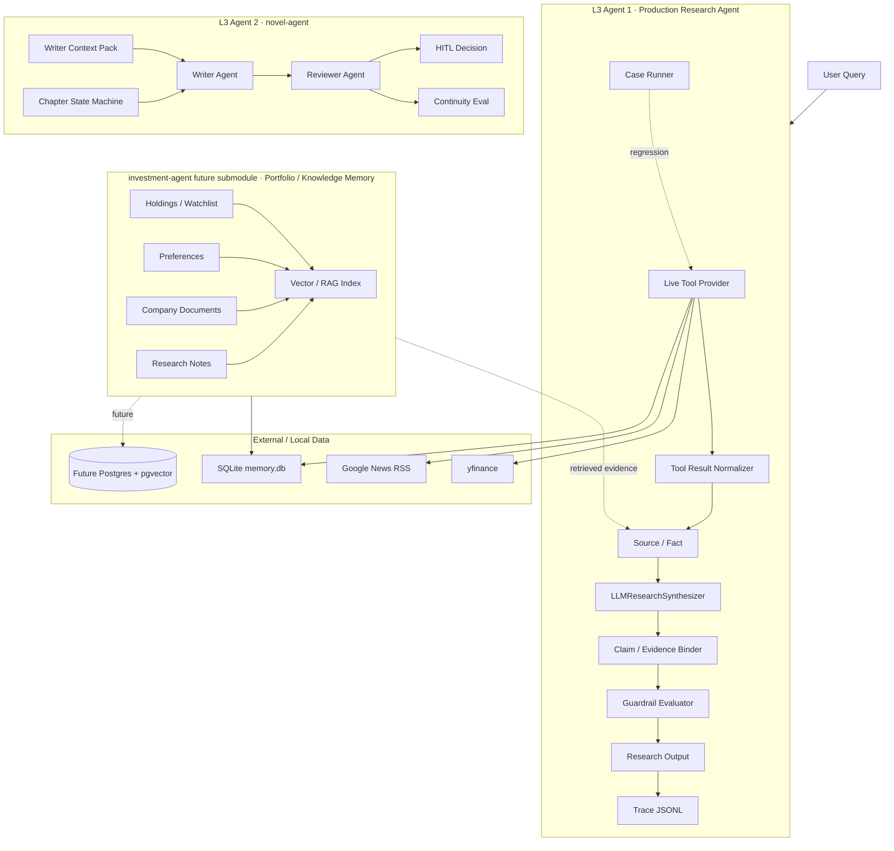

# 项目全景图与里程碑

最后更新：2026-06-04
当前云端进度的事实来源：VPS 仓库提交历史与 `docs/EXECUTION_PLAN_P1.md`。

## 这个项目为什么存在

`investment-agent` 是一个用于学习和展示的金融垂直 AI Agent 项目，目标是把一个 Agent 做成更接近生产系统的形态。它不是交易顾问，也不应该直接给出买入、卖出、加仓、清仓、持有、做空等操作建议。

这个项目真正要证明的是：一个金融研究 Agent 可以如何做到：

- 通过工具获取实时和历史市场上下文；
- 把杂乱的工具输出转成可追踪的证据；
- 约束 LLM 只能基于有来源的事实做归纳；
- 把每个关键结论绑定回证据；
- 在输出前通过 guardrail 做质量和安全检查；
- 保存 trace 和 regression case，支持可重复评估；
- 在不丢失 provenance 的前提下，逐步演进到组合记忆和 RAG。

这条学习路线是工程优先的：每加一个能力，都应该暴露一个失败模式、增加一条边界，并沉淀成可复用的产物。

## 两条 L3 Agent 主线

当前学习路线包含两个独立的 L3 Agent 项目。它们故意选择不同的问题域，用来训练不同的生产化能力。

### L3 Agent 1：investment-agent / Production Research Agent

目标：回答用户的投资研究问题，并生成可追踪、带 guardrail 的研究输出。

核心链路：

```text
User Query
 -> Live Tool Provider
 -> Tool Result Normalizer
 -> Source / Fact
 -> LLMResearchSynthesizer
 -> Claim / Evidence Binder
 -> Guardrail Evaluator
 -> Research Output
 -> Trace JSONL
 -> Case Runner / Regression Report
```

当前状态：VPS 上已经完成 P1 Day 1-6。

### L3 Agent 2：novel-agent / Long-Context Creative Agent

目标：生成和修改长篇小说，重点是稳定的故事状态、writer/reviewer 分离、连续性检查，以及人工确认流程。

计划职责：

- writer context pack；
- chapter state machine；
- writer agent 与 reviewer agent；
- reviewer 基于 canon/context 给出有证据的 review artifact；
- rewriter loop；
- accept / revise / regenerate 的 HITL 决策；
- 针对角色、情节、时间线、伏笔、风格的 continuity eval。

当前状态：这是另一个独立对照项目，不在本仓库内。它应该保持为创作密集、长上下文方向的 L3 Agent，不应被重命名成投资记忆子系统。

### investment-agent 未来子模块：Portfolio / Knowledge Memory

这不是第二个 L3 Agent，而是 `investment-agent` 内部未来要建设的研究记忆与 RAG 子模块。

计划职责：

- 持仓和 watchlist 状态；
- 用户投资偏好；
- 公司 profile 与 filings metadata；
- 年报、电话会 transcript、研究笔记；
- thesis / anti-thesis 记录；
- valuation assumptions；
- 文档切块与 embedding；
- RAG 检索结果必须先变成 `Source` / `Fact`，而不是作为不可追踪文本直接塞进 prompt。

当前状态：只有概念设计和既有 SQLite/config 基础；完整的 RAG ingestion 和 retrieval 尚未实现。

## 系统全景图



## 当前证据模型

两个 L3 Agent 都应该共享同一种生产化思路：

```text
Source = 信息来自哪里
Fact = 从 Source 中抽出的、可用于推理的事实
Claim = Synthesizer 基于事实生成的研究结论
Evidence = Claim 到 Fact/Source 的可验证绑定关系
Guardrail = 输出后的安全与质量检查
Trace = 可回放的 JSONL 审计记录
```

这点很重要：未来即使引入 RAG，也不能绕过研究链路。被检索出来的 chunk 应该先变成 `Source` / `Fact`，再交给 synthesizer 和 guardrail 使用。

## investment-agent 生产模块地图

这个格式参考 `novel-agent` 的生产级系统全景图：`✅` 表示模块已存在并可运行；`🟡` 表示已有可用切片但还不是生产版；`🔲` 表示还只是计划能力。

```text
+----------------------------------------------------------------------------+
|              investment-agent production research agent map                 |
|                  ✅ exists | 🟡 partial | 🔲 missing       |
+----------------------------------------------------------------------------+

+------------------------------+  +------------------------------+
| 1. Research Loop             |  | 2. Tools / Data              |
+------------------------------+  +------------------------------+
| ✅ research_demo         |  | ✅ memory_server          |
| ✅ RunState / models     |  | ✅ finance_server         |
| ✅ Source / Fact         |  | ✅ news_server            |
| ✅ Claim / Evidence      |  | ✅ corporate_actions      |
| 🟡 Intent Router     P1  |  | 🟡 live failure guard P1  |
| 🟡 Planner           P1  |  | 🔲 tool budget        P1  |
| 🟡 Runtime recovery  P1  |  | 🔲 provider registry  P2  |
+------------------------------+  +------------------------------+

+------------------------------+  +------------------------------+
| 3. Evidence / Source          |  | 4. LLM Synthesizer            |
+------------------------------+  +------------------------------+
| ✅ Source model          |  | ✅ Mock synthesizer        |
| ✅ Fact model            |  | ✅ Anthropic structured    |
| ✅ Evidence binder       |  | ✅ Claim schema            |
| ✅ timestamps            |  | 🟡 prompt policy       P1  |
| 🟡 reliability model P1  |  | 🟡 invalid claim repair P1 |
| 🟡 citation surface  P1  |  | 🔲 model routing       P2  |
| 🔲 external URLs     P2  |  | 🔲 cost/latency policy P2  |
+------------------------------+  +------------------------------+

+------------------------------+  +------------------------------+
| 5. Guardrail / Policy         |  | 6. Eval / Regression          |
+------------------------------+  +------------------------------+
| ✅ no trading advice     |  | ✅ 10 boundary cases       |
| ✅ evidence required     |  | ✅ 3 data-quality cases    |
| ✅ timestamp required    |  | ✅ json-report records     |
| ✅ risk/unknown required |  | 🟡 trace assertions    P1  |
| 🟡 freshness rules   P1  |  | 🟡 live failure cases  P1  |
| 🟡 conflict rules    P1  |  | 🔲 LLM invalid-id case P1  |
| 🔲 repair/degrade    P1  |  | 🔲 citation eval       P2  |
+------------------------------+  +------------------------------+

+------------------------------+  +------------------------------+
| 7. Output / HITL              |  | 8. Memory / RAG               |
+------------------------------+  +------------------------------+
| ✅ research snapshot     |  | ✅ SQLite memory.db        |
| ✅ human questions       |  | ✅ config portfolio/watch  |
| ✅ memo sections     P1  |  | 🟡 preferences memory  P1  |
| 🟡 investment memo   P1  |  | 🔲 filings metadata    P2  |
| ✅ evidence table    P1  |  | 🔲 document ingestion  P2  |
| 🔲 approval gates    P1  |  | 🔲 embeddings/pgvector P2  |
| 🔲 decision log      P2  |  | 🔲 retrieval->Fact     P2  |
+------------------------------+  +------------------------------+

P0 main path: Research Boundary -> Source/Fact -> Synthesizer -> Evidence Binder -> Guardrail -> Trace
P1 quality loop: Case Runner -> Freshness/Missing/Conflict -> Degradation -> Trace-to-Eval
P2 research depth: Investment Memo -> Portfolio/Knowledge Memory -> RAG Retrieval -> Citation-rich Memo
```

### 当前完成度热力图

```text
✅ 已完成：
  ResearchRunState / Source / Fact / Claim / Evidence
  Tool Result Normalizer / Live Tool Provider / corporate_actions ground truth
  Mock + Anthropic structured synthesizers
  Evidence Binder / Guardrail Evaluator / Trace JSONL
  Research Snapshot renderer / Investment Memo renderer / Evidence Table
  10 条 boundary cases + 3 条 frozen data-quality cases

🟡 部分完成：
  Intent Router / Planner / Runtime recovery
  tool failure handling / freshness rules / conflict rules
  source reliability / citation surface
  prompt policy / invalid claim filtering
  HITL 目前只是问题清单，还不是 approval gates
  preferences 和 SQLite memory foundation

🔲 尚未完成：
  显式 Tool Budget / Provider Registry / Degradation policy
  更丰富的 trace assertions / live failure regression cases
  external URL citations 和 provider reliability matrix
  年报 / filings / transcripts ingestion
  embeddings / pgvector / retrieval-to-Source-Fact bridge
  model routing / cost and latency policy
  decision log 和显式 HITL approval gates
```

### 阶段路线图

```text
P0 - 可追踪的投资研究核心
  1. Boundary document
  2. ResearchRunState + Source/Fact/Claim/Evidence
  3. Trace JSONL
  4. Guardrail evaluator
  5. Demo research output
  状态：✅ 已通过 P1 Day 1-3 完成

P1 - Regression 与数据质量控制
  1. Case Runner boundary suite
  2. Anthropic structured outputs
  3. stale/missing/conflict facts
  4. frozen data-quality cases
  5. trace-to-eval records
  6. memo trace event assertion
  状态：🟡 部分完成 / ✅ Day 4-6 已完成主要切片；仍缺 live failure cases 和更丰富的 trace assertions

P2 - Memo-grade research experience
  1. Investment Memo renderer
  2. evidence table and freshness notes
  3. richer citation surface
  4. explicit HITL gates
  5. decision log
  状态：🟡 Day 6 已完成 memo shape；P2 仍需 richer citation、explicit HITL gates 和 RAG-backed memo

P3 - Portfolio memory and RAG
  1. holdings/watchlist/preference schema hardening
  2. filings / annual reports / transcripts metadata
  3. document chunking and embeddings
  4. retrieval-to-Source/Fact bridge
  5. memo-grade company research with citations
  状态：🔲 计划中
```

## 里程碑

| 阶段 | 里程碑 | 当前状态 |
|---|---|---|
| W1 | MCP foundation：memory server + description A/B | 已完成 |
| W2 | Multi-server collaboration：finance + news + split detection | 已完成 |
| W2 D5 | Corporate actions ground-truth fallback 与 24h counterexample loop | 已完成 |
| W3 | SDK orchestration 与 regression harness | 已完成 |
| W4 | Showcase assets：case study、ADR、diagram、resume snippet | 已完成 |
| W5 | Stateful/context engineering experiments | 部分完成 / 历史学习线 |
| P1 Day 1 | VPS fixture/live mock acceptance | 已完成 |
| P1 Day 2 | Tool Result Normalizer extracted | 已完成，commit `ba3d69a` |
| P1 Day 3 | Live + Anthropic structured synthesis | 已完成，commit `ff34aa4` |
| P1 Day 4 | Case Runner expanded to 10 boundary cases | 已完成，commit `c2eac74` |
| P1 Day 5 | Freshness / missing data / conflict / unknown minimal rules | 已完成，commit `59d398a` |
| P1 Day 6 | Investment memo output shape | 已完成，commit `e269555` |
| P1 Day 7 | P1 summary docs + interview explanation material | 进行中，双语主文档 `docs/P1_FINAL_NARRATIVE_CN.md` / `docs/P1_FINAL_NARRATIVE.md` |
| P2 | investment-agent portfolio / knowledge memory submodule schema and RAG ingestion plan | 计划中 |
| P3 | Retrieval-to-Source/Fact integration and memo-grade company research | 计划中 |
| novel-agent P0 | Writer context pack + chapter state machine | 在独立 repo 中计划 |
| novel-agent P1 | Writer / reviewer / rewriter + HITL + continuity eval | 在独立 repo 中计划 |

## 旧 L3 全景图中的生产化缺口

旧的 L3 production gap map 仍然有效。P1 Day 1-5 只是完成了可追踪投资研究核心，并没有完成所有生产模块。

| 生产模块 | investment-agent 当前状态 | 剩余缺口 | novel-agent 对应模块 |
|---|---|---|---|
| Intent Router | 未显式实现 | 区分 research / advice / portfolio / memo / data request | 区分 plan / write / review / rewrite / HITL intent |
| Planner | 大多是隐式流程 | 显式 plan 与 tool budget | chapter plan 与 rewrite plan |
| Orchestrator / Runtime | 轻量 `research_demo.py` | 更强 run lifecycle 与 recovery | chapter workflow runtime |
| Tool Registry / Tool Schema | 部分实现 | 更严格的 tool input/output schema 与 validation | chapter operation registry |
| Tool Executor | 部分实现 | retry、timeout、cache、degradation policy | generation step 的 retry/recover |
| Context Builder / Context Pack | 通过 facts 部分实现 | memo context builder 与 retrieval pack | writer context pack |
| Memory / State | SQLite/config 基础 | holdings/watchlist/filings/notes/RAG state | chapter/story/canon state |
| Source Verification / Citation | 已有 Source/Fact/Evidence 核心 | 更丰富的 provider reliability 与 citation surface | story canon verification |
| Policy / Guardrail | 已有最小 evaluator | 更完整的 policy matrix 与 repair/degrade flow | style/canon/pacing policy |
| HITL | 输出中提出确认问题 | 显式 approval gates | accept/revise/regenerate decisions |
| Trace Logger | 已有 JSONL trace | 更丰富的 trace assertions 与 failure capture | chapter run trace |
| Eval / Regression | 当前 13 cases | 更多 live failure cases 与 citation checks | continuity/golden chapter eval |
| Model Routing | 未实现 | 按 task/risk/cost 选择模型 | writer/reviewer model split |

这份 backlog 要持续保留。不要把它压缩成 Day 6/Day 7 计划；Day 6/Day 7 只是下一步 P1，不是完整 L3 生产化终点。

## 当前 P1 验证快照

Day 6 在 VPS 上记录的最新验证命令：

```bash
.venv/bin/ruff check src/agents/research_demo.py src/research/*.py src/eval/research_case_runner.py
.venv/bin/python -m pytest
.venv/bin/python -m src.eval.research_case_runner --data-source fixture --synthesizer mock --suite all
.venv/bin/python -m src.eval.research_case_runner --data-source live --synthesizer mock --suite boundary
```

观测结果：

- `pytest`：18 passed。
- fixture + mock all suite：13/13 PASS，且每条 case 都包含 `memo_trace=True`。
- live + mock boundary suite：10/10 PASS，且每条 case 都包含 `memo_trace=True`。
- fixture + mock demo：Investment Research Memo rendered，Guardrail PASS。
- live + anthropic 已在 Day 3 验证过，Guardrail PASS。

## 已完成与未完成

已完成：

- Live tool bundle fetch path。
- 工具结果归一化为稳定的 `Source` / `Fact` 对象。
- Anthropic structured-output synthesizer。
- Claims 到 facts/sources 的 evidence binding。
- Rule-based guardrail evaluator。
- Trace JSONL writing。
- 10 条 boundary regression suite。
- 3 条 frozen data-quality suite。
- 最小 stale quote、missing news、conflict facts。

尚未完成：

- 持久化 company research document store。
- Annual report / filing ingestion。
- Embedding 与 pgvector retrieval。
- Retrieval-to-Source/Fact bridge。
- 显式 intent router、planner、tool budget、degradation policy。
- HITL approval gates，目前只有 rendered confirmation questions。
- Model routing。
- 跨独立 provider 的 rich conflict detection。
- 从真实 production-like run 沉淀的 live failure regression cases。
- 面试可讲的 P1 final narrative。

## 交付时间线与简历 readiness

每次开始新任务时，都用这张表和实际进度做对照，并标注当前是提前、按计划，还是延期。

| 日期 | 里程碑 | 预期产物 | 简历投递 readiness |
|---|---|---|---|
| 2026-06-04 Thu | P1 Day 6：Investment Memo output shape | memo renderer、evidence table、freshness notes、unknowns/conflicts、trace reference | 已完成，commit `e269555` |
| 2026-06-05 Fri | P1 Day 7：P1 summary 与 interview material | P1 summary doc、architecture explanation、3-minute pitch、resume bullets | 接近 v1 |
| 2026-06-06 Sat | Resume package v1 cleanup | README/showcase/resume snippet 更新，final demo commands 验证 | 可进入最终 review |
| 2026-06-07 Sun | First application batch | 用 P1 story 投递第一批 Agent / AI application roles | 开始 v1 投递 |
| 2026-06-08 至 2026-06-12 | P2 memory/RAG schema | holdings、watchlist、filings、research notes、thesis/anti-thesis schema | 边投递边增强 |
| 2026-06-13 至 2026-06-16 | RAG ingestion 与 retrieval-to-Source/Fact | documents/chunks/metadata，检索结果能转为 Source/Fact | 技术深度更强 |
| 2026-06-17 至 2026-06-20 | Memo-grade company research | citation-rich company memo、更丰富 eval、failure regression cases | 更强生产级版本 |
| 约 2026-06-21 | Production-grade v2 checkpoint | P1 + P2 integrated narrative and demo | 更强面试版本 |

### Readiness 定义

- **Application v1 readiness**：P1 loop 稳定，Day 6 memo shape 存在，Day 7 explanation material 完成，README/showcase 能清楚讲出 traceable research-agent story。
- **Production-grade v2 readiness**：research loop 能使用持久化 portfolio/company knowledge，retrieved materials 会变成 Source/Fact evidence，memo-grade output 有更丰富 citation 与 regression coverage。

### 进度检查规则

每次新任务开始时，先回答：

1. 相对于上面的时间表，我们是提前、按计划，还是延期？
2. 当前阻塞 resume v1 或 production-grade v2 的里程碑是什么？
3. 最近一次代码改动新增的是 trace、guardrail、eval、memo，还是 memory/RAG 能力？

## 下一步工作

### Day 6：Investment Memo Output Shape

状态：已完成，commit `e269555`。

目标：把当前 research snapshot 转成 memo 形态，但不能变成交易建议。

预期章节：

- Boundary Statement
- Executive Summary
- Evidence Table
- What We Know
- Risks
- Unknowns / Conflicts
- Freshness Notes
- User Preference Fit
- Human Confirmation Points
- Trace Reference

### Day 7：P1 Final Narrative

目标：产出面向人的说明材料，讲清楚 production research loop，以及每条边界为什么存在。

预期产物：

- P1 summary document；
- updated architecture diagram；
- Source / Fact / Claim / Evidence / Guardrail 的面试解释；
- resume/showcase deltas；
- next-phase RAG plan。

## 新 Codex 会话阅读顺序

1. `docs/PROJECT_PANORAMA_AND_MILESTONES_CN.md`（中文全景图，优先读）
2. `docs/P1_FINAL_NARRATIVE_CN.md`（Day 7 中文主文档）
3. `docs/P1_FINAL_NARRATIVE.md`（Day 7 英文镜像）
4. `docs/PROJECT_PANORAMA_AND_MILESTONES.md`（英文全景图）
5. `docs/EXECUTION_PLAN_P1.md`
6. `docs/RESEARCH_CASE_EVAL.md`
7. `src/agents/research_demo.py`
8. `src/research/models.py`
9. `src/research/normalizers.py`
10. `src/research/synthesizer.py`
11. `src/research/evaluator.py`
12. `src/eval/research_case_runner.py`
