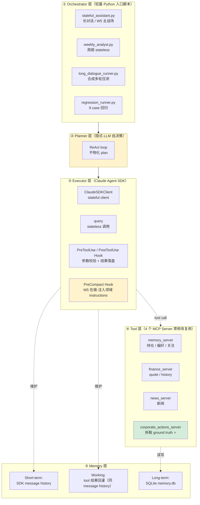
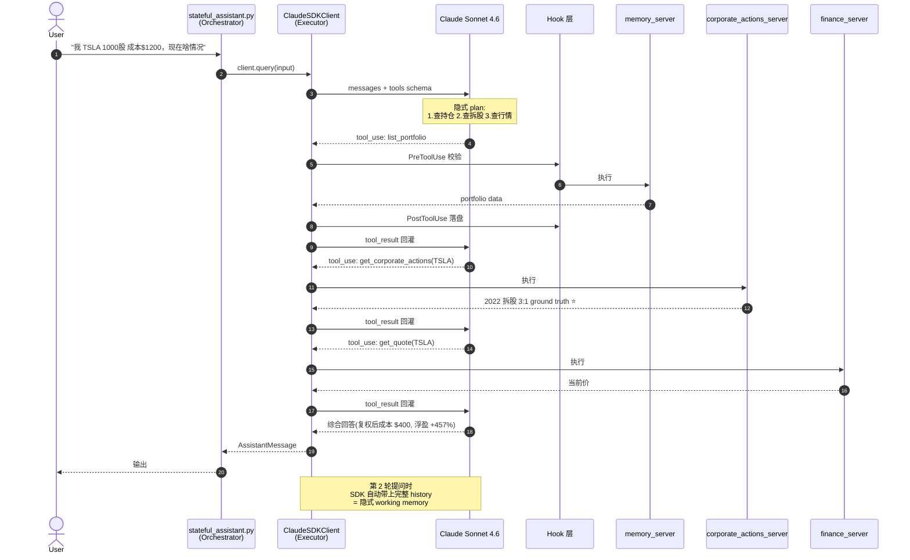

# 架构设计

> **设计取向**：Agent 系统的本质 = LLM + 控制循环 + 外部能力。围绕三个核心矛盾分层：**LLM 不可靠 / 上下文有限 / 工具调用有副作用**。

## 静态分层 — 五层框架与当前实现的对应关系



**关键说明**：
- 黄色块 = 隐式实现 / W5 进行中
- 绿色块 = 项目核心差异化（拆股 ground truth 兜底 LLM 训练知识漂移）
- **没有独立 Orchestrator 进程**：Orchestrator = Python 入口脚本本身。多客户端零修改复用（Claude Desktop / Claude Code / 自研 agent）靠 MCP 协议层实现
- **没有显式 Planner**：当前场景是短链只读查询（2-4 个 tool call），ReAct 隐式 plan 够用。切换到显式 Plan-and-Execute 的条件：任务步数 >5-7、出现不可逆写操作、需要用户审批 plan

## 动态时序 — 一次完整调用（以拆股查询为例）



**这张图体现的工程价值**：
1. **LLM 自路由**：步骤 4 / 7 / 10 三次 tool_use 顺序完全由 LLM 决定，无外部调度器
2. **Ground truth 夹在推理链路中间**（步骤 8）而不是事后校验，所以能在 LLM 推理时直接矫正训练知识漂移
3. **Hook 是基础设施**：每次 tool call 都有 Pre/Post 拦截，是 9/9 回归测试能跑通的前提

## Agent 入口清单

| 入口 | 状态 | 用途 | 备注 |
|---|---|---|---|
| `stateful_assistant.py` | W5 主战场 | 长对话 stateful 骨架 | 验证跨 query 的 message 维护 |
| `weekly_analyst.py` | 稳定 | 周报生成 | stateless `query()` |
| `long_dialogue_runner.py` | 实验 | 合成多轮压测 | 配 `synthetic_user.py` |
| `regression_runner.py` | 稳定 | 9 case 回归 | 正样本 + 负样本全过 |

System Prompt 共同要点：
- 严谨投资分析师定位，区分事实与观点
- 涉及历史价位判断**强制先调 `get_corporate_actions`** 拿拆股 ground truth
- 不给买卖建议，只提供分析视角
- 不确定的事项明确标注

## 记忆系统设计

### 数据模型

```python
# 持仓
Portfolio:
    symbol: str        # 股票代码 e.g. AAPL, 600519.SS
    name: str          # 公司名
    market: str        # 市场 US/CN/HK
    shares: float      # 持仓数量
    avg_cost: float    # 平均成本
    added_at: datetime

# 关注列表
Watchlist:
    symbol: str
    name: str
    market: str
    reason: str        # 关注原因
    added_at: datetime

# 投资偏好
Preferences:
    admired_investors: list[str]    # 欣赏的投资者
    investment_style: str           # 投资风格描述
    risk_tolerance: str             # 风险偏好 conservative/moderate/aggressive
    focus_sectors: list[str]        # 关注行业
    analysis_language: str          # 分析语言 zh/en

# 历史分析
Analysis:
    date: date
    type: str          # weekly/adhoc
    content: text      # 分析内容 (markdown)
    companies: list    # 涉及公司
    events: list       # 涉及事件
```

## API Keys 需求

| 服务 | 用途 | 免费额度 |
|------|------|---------|
| Anthropic API | Claude Agent | 按量付费 |
| NewsAPI | 新闻数据 | 100 次/天 (免费) |
| Alpha Vantage | 美股数据 | 25 次/天 (免费) |
| Yahoo Finance | 行情数据 | 无限制 (yfinance 库) |

## 技术选型

- **语言**: Python 3.11+
- **Agent 框架**: Claude Agent SDK (`claude_agent_sdk`)
- **MCP 实现**: `mcp` Python SDK
- **数据存储**: SQLite (轻量，无需部署数据库)
- **定时任务**: cron (macOS launchd) 或 Python schedule
- **HTTP 客户端**: httpx
- **数据处理**: pandas (可选，用于财务数据分析)
