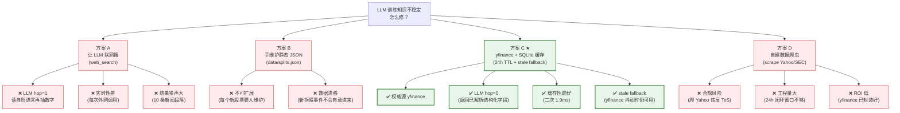

# ADR-003：corporate_actions 数据源选 yfinance+SQLite，不选 LLM 联网搜索

- **状态**：Accepted
- **日期**：2026-05-14（反例闭环当日）
- **决策者**：项目作者

---

## Context（背景）

5/13 晚发现反例：Claude 在同一天两次 session 给出 TSLA 不同拆股精度（15:1 vs 3:1）。需要外部 ground truth 来源解决"LLM 训练知识不稳定"问题。

候选数据源很多，但要选哪一种？时间窗口紧（计划 24h 内闭环）。

---

## Decision（决策）

**方案 C：yfinance + SQLite 缓存（24h TTL + stale fallback）**

接口：

```python
get_corporate_actions(symbol: str, include_dividends: bool = False) -> {
  "actions": [{"type": "split", "date": "2020-08-31", "ratio": "5:1", "factor": 5.0}, ...],
  "splits_count": 2,
  "cumulative_split_factor": 15.0,
  "source": "yfinance" | "cache" | "stale_cache",
  "last_fetched": "..."
}
```

---

## 决策树（视觉版）



---

## Consequences（结果）

### 正面

- ✅ **5/14 当日实施完成**（约 300 行代码 + 测试）
- ✅ **smoke test 通过**：TSLA 返回 2020-08(5:1) + 2022-08(3:1)、cumulative=15.0
- ✅ **二次调用 1.9ms**（SQLite 缓存命中）
- ✅ **Case D' 4/4 维度全过**：拆股识别 15:1、复权 $80、浮盈 +457%
- ✅ **复用 memory.db**：不增加新数据库依赖（共享 SQLite 文件，PK 用 (symbol, action_type, date) 三元组）

### 负面

- ⚠️ **依赖 yfinance**：upstream 接口变动会影响（已加 stale fallback）
- ⚠️ **只覆盖美股 + 港股 + A股**：yfinance 支持范围之外的市场暂不覆盖
- ⚠️ **24h TTL 可能不够实时**：如果当天发生拆股，理论上要 24h 后才进库（但拆股事件本身是 pre-announce，时效性 OK）
- ⚠️ **factor 字段 split/dividend 复用**：可读性略差，但避免了两个字段重复表达"调整因子"

---

## Alternatives Considered（备选方案）

详见上方决策树。核心权衡：

| 维度 | A 联网搜 | B 静态 JSON | C ★ | D 自建爬虫 |
|---|---|---|---|---|
| LLM hop | 1（差） | 0 | **0** | 0 |
| 可扩展性 | 高 | 低（手维护） | **高** | 高 |
| 实施成本 | 中（要做 RAG 抽取） | 低 | **低** | 高 |
| 数据权威性 | 低（新闻段落） | 中 | **高（yfinance）** | 高 |
| 合规风险 | 低 | 0 | **0** | 高（爬虫 ToS） |
| 24h 闭环可行性 | 中 | 高 | **高** | 低 |

---

## 后续验证

- ✅ Case D' 5/14 实测验证 4/4 维度
- 🔲 NVDA / AAPL / 09988.HK 泛化验证（W3 前补）
- 🔲 description nudge 在不需要场景的误触发率测试（负样本）
- 🔲 监控 yfinance upstream 变动告警

---

## 关联

- 反例叙事全文：[case-study-corporate-actions.md](../case-study-corporate-actions.md)
- 知识分层设计（这个 ADR 是其工程落地）：[ADR-004](./004-knowledge-layering.md)
- LLM hop 最小化机制层归因：[llm-hop-minimization.md](../../../../../memory/shared/best-practices/llm-hop-minimization.md)
- 项目反思全文：[llm-knowledge-stability.md](../../../../../memory/projects/investment-agent/llm-knowledge-stability.md)
