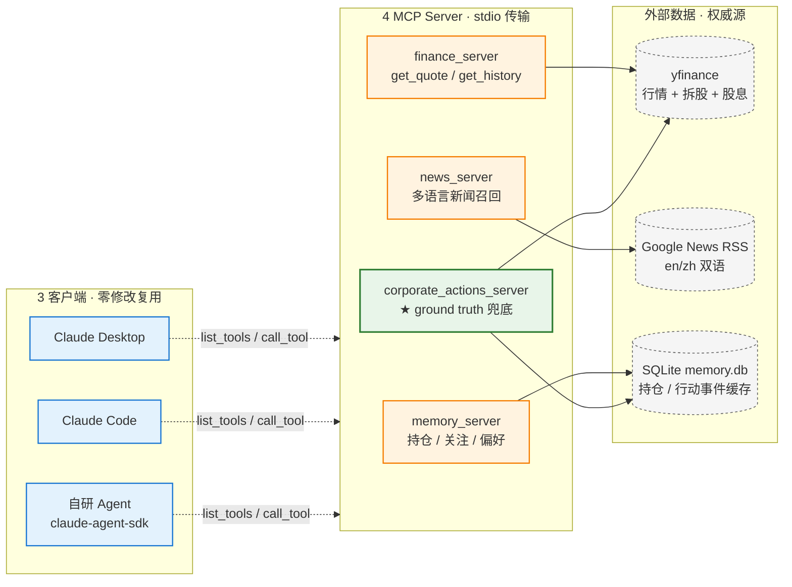

# 架构总图（A）— 系统总览

> 用途：README 首图 / 录屏开场 / 简历附件首图 / 面试白板速画
> 目标：让面试官 10 秒看懂"几个 Server、谁调谁、外部依赖是谁"。

---

## Mermaid 源码

---

## 视觉解读（看图时要让面试官读出的 4 个信号）

1. **3 客户端零修改复用** — 同一份 MCP Server，被 Desktop / Code / SDK 三种 Client 同时使用，零修改。这是 MCP 协议的核心工程价值。
2. **4 Server 协作无 orchestrator** — 客户端到 Server 是 N×M 网格调用，编排逻辑是 LLM 本身（不是另一个程序）。description 边界写好后工具池可线性扩展。
3. **corporate_actions 是高亮节点（绿色）** — 全图唯一一个绿色 = 反例闭环产物。视觉上自然引导面试官问"这个绿框是干嘛的？"，给反例叙事开场。
4. **外部数据源虚线框（灰色）** — 强调边界：Server 之内是项目代码，之外是权威数据源（不是自己造数据）。

---

## 在不同场合的使用方式

| 场合 | 用法 |
|---|---|
| README 首图 | 直接渲染 Mermaid（GitHub 原生支持） |
| 录屏开场 30s | 全屏停留 8s，按 "客户端 → Server → 数据源"顺序口头扫一遍 |
| 简历附件 PDF 首图 | 导出 PNG（mermaid CLI 或 mermaid.live） |
| 面试白板 | 现场只画 3 个框 + 3 条线（客户端 / Server / 数据源），15 秒搞定 |
| 终面追问"为什么这么设计" | 拿这张图引出 ADR-002（无 orchestrator）和 ADR-003（corporate_actions） |

---

## 已知简化（如果被追问，要能解释）

- **stdio 传输** vs HTTP+SSE：本地开发用 stdio 够（多 Client 同时跑也 OK，每个 Client 独立 fork 一个 Server 进程）；要远程跨主机才需要 HTTP+SSE。
- **claude-agent-sdk 自研 Agent 尚未实现**（W3 任务），但 sdk 入口 stateless `query()` 已在简历叙事中提及，图里画上是合理的"近期路线"展示。
- **图里没画 LLM**：LLM 是 Client 进程内部的，画进来反而模糊"谁是 MCP 服务器、谁是消费者"的边界。

---

## 关联

- 总览叙事见 [resume-snippet.md](../resume-snippet.md)
- 完整 4 张架构图集见 [diagrams/](.) 目录（后续补：B 知识分层 / C Case D' 时序 / D 反例闭环时间线）
