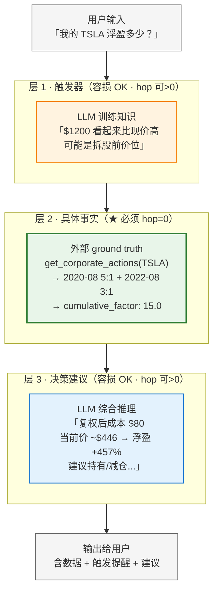
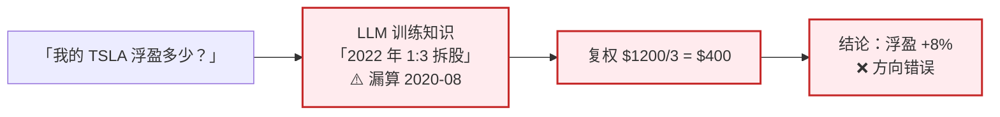

# 架构图 B — 知识分层设计模式

> 用途：ADR 主图 / 技术博客封面图 / 终面"为什么这么设计"问题的答题图
> 目标：让面试官看图就能说出"哦，他们把 LLM 知识 / 外部 ground truth / LLM 综合判断分开了"

---

## Mermaid 源码

---

## 三层角色对照表

| 层 | 角色 | 提供者 | 容错率 | LLM hop | 失败模式 |
|---|---|---|---|---|---|
| 1. 触发器 | "可能有问题"信号 | **LLM 训练知识** | 高 | 可 >0 | 漏识别 → 用户自己发现 |
| 2. 具体事实 | 日期 / 比例 / 数字 | **外部 ground truth** | **必须 0** | **必须 0** | 工具故障 → fallback / stale |
| 3. 决策建议 | 持有 / 加仓 / 减仓 | **LLM 综合推理** | 高 | 可 >0 | 建议偏差 → 用户判断 |

---

## 核心原则（要让面试官记住的两句话）

1. **LLM 提示要存在感、不要权威感**
   - ✅ "可能是拆股前价位，建议核对" → 触发用户主动确认
   - ❌ "拆股复权后是 $80 USD，浮盈 +361%" → LLM 直接给数字让用户当真

2. **LLM hop 最小化**
   - 每经过一次 LLM 解析 = 一次注意力损失风险
   - 关键事实 hop=0（结构化字段直给）
   - 模糊判断 hop>0 OK（LLM 越想越好）

---

## 反例：5/13 晚没有第 2 层时的失败模式

**机制层归因**：长 session + 多工具调用 + 输出长建议的上下文压力下，关键事实被概括化处理。同一模型同一天可以输出不同精度（早 15:1 / 晚 3:1）。

---

## 在不同场合的使用方式

| 场合 | 用法 |
|---|---|
| ADR-004（知识分层设计） | 主图 |
| 技术博客《LLM 训练知识不稳定》 | 封面图 |
| 终面"你怎么解决幻觉" | 拿这图答 + 引出 LLM hop 最小化 |
| 一面"为什么不让 LLM 联网搜" | 拿这图答："web_search 是 hop=1，关键事实必须 hop=0" |

---

## 关联

- 完整原则推导：[llm-hop-minimization.md](../../../../../memory/shared/best-practices/llm-hop-minimization.md)
- 反例叙事全文：[case-study-corporate-actions.md](../case-study-corporate-actions.md)
- 上一张图（总览）：[01-overview.md](./01-overview.md)
