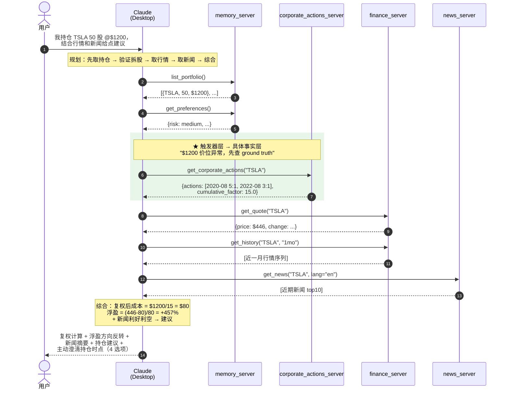

# 架构图 C — Case D' 调用时序

> 用途：Case Study 配图 / 录屏第 3 段（实跑演示）/ 一面"Agent 真的能自主串调用？"答题图
> 目标：让面试官看到"一句话用户输入 → 7 次工具调用 → 跨 4 个 Server"全过程

---

## Mermaid 源码

---

## 7 次工具调用拆解

| # | 工具 | 触发原因 | 是否反例闭环新增 |
|---|---|---|---|
| 1 | `memory.list_portfolio` | 拿持仓 | 否（原有） |
| 2 | `memory.get_preferences` | 拿偏好（风险承受、关注主题） | 否（原有） |
| 3 | **`corporate_actions.get_corporate_actions`** | ★ description nudge："涉及历史价位先调本工具" | **是（5/14 新增）** |
| 4 | `finance.get_quote` | 拿当前价 | 否（原有） |
| 5 | `finance.get_history` | 拿近期走势辅助判断 | 否（原有） |
| 6 | `news.get_news` | 拿利好利空 | 否（原有） |
| 7 | （LLM 综合，无工具调用） | 复权计算 + 综合输出 | — |

**反例闭环前**：4 次工具调用，无 #3，复权用 LLM 训练知识猜（5/13 晚漏算 2020-08）
**反例闭环后**：7 次工具调用，#3 拿到结构化 ground truth，复权 hop=0

---

## 关键看点（讲给面试官的 3 句话）

1. **没有 orchestrator**：调用顺序是 LLM 看完 4 个 Server 的 description 后自主决定的，不是代码硬编排
2. **description nudge 的工程价值**：`corporate_actions` 这个新 Server 被自动调用，靠的是 `memory.add_holding` 和 `finance.get_quote` 的 description 里写了"涉及历史价位先调本工具"
3. **绿色高亮的两步是反例闭环的核心**：触发器层（LLM 觉得价位异常）→ 具体事实层（结构化拿到 15:1）—— 知识分层模式在真实调用链里的体现

---

## 3 个未设计的涌现行为（额外加分点）

| 涌现 | 内容 | 为什么是涌现 |
|---|---|---|
| 1 | 触发器表达逐字命中"价位异常 → 先查历史拆股事实" | 与设计文档措辞高度一致，没人教过 |
| 2 | 主动弹 4 选项澄清持仓时点 | "存在感不要权威感"的 UX 落地，description 没指定 |
| 3 | 主动提议更新 portfolio 口径 | 跨工具协同，没人写过这个逻辑 |

---

## 在不同场合的使用方式

| 场合 | 用法 |
|---|---|
| Case Study 配图 | 嵌入"R Result"章节 |
| 录屏第 3 段（2 分钟实跑演示） | 配合 Claude Desktop 真跑截图 |
| 一面"Agent 怎么知道调哪个工具" | 拿这图答 + 引出 description 边界设计 |
| 终面"涌现行为是 LLM 随机的吗？" | 拿这图答："不是随机，是 description nudge 后的可复现行为" |

---

## 关联

- Case Study 全文：[case-study-corporate-actions.md](../case-study-corporate-actions.md)
- 知识分层设计：[02-knowledge-layering.md](./02-knowledge-layering.md)
- 总览图：[01-overview.md](./01-overview.md)
