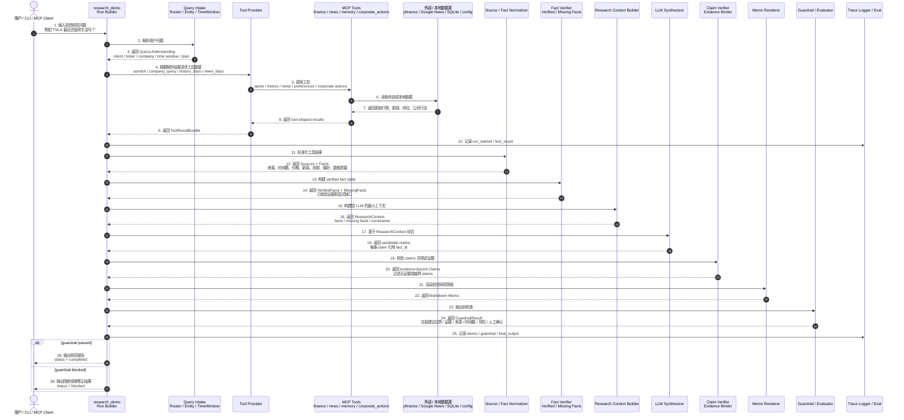

# 研究运行时序图（E）— 单次 Investment Research Run

> 用途：解释当前 P1 research loop 的真实执行顺序，澄清它是 single-agent pipeline / workflow orchestration，不是 multi-agent orchestrator。
> 箭头含义：一次用户研究请求中的执行顺序和数据转换方向；不表示代码 import 依赖、服务部署依赖或多 agent 调度关系。

---

## Mermaid 源码

---

## 节点说明

| 节点 | 当前代码位置 | 作用 |
|---|---|---|
| `research_demo / Run Builder` | `src/agents/research_demo.py` | 串联一次 research run，创建并更新 `ResearchRunState`，记录 trace。 |
| `Query Intake` | `src/research/query_intake.py` | 解析用户问题、标的、意图、研究窗口和研究计划。 |
| `Tool Provider` | `src/research/tool_provider.py` | 在 `live` 和 `fixture` 模式下取工具形态结果，并隔离单工具失败。 |
| `MCP Tools` | `src/mcp_servers/` | 提供行情、新闻、记忆、公司行动等工具能力。 |
| `Source / Fact Normalizer` | `src/research/normalizers.py` | 把工具结果转成可追踪的 `Source` 和 `Fact`。 |
| `Fact Verifier` | `src/research/fact_verifier.py` | 构建已核验事实表，并显式记录缺失事实。 |
| `Research Context Builder` | `src/research/context_builder.py` | 把完整 run state 收敛成 LLM 可见的最小研究上下文。 |
| `LLM Synthesizer` | `src/research/synthesizer.py` | 基于 `ResearchContext` 生成结构化 candidate claims 和人工确认点。 |
| `Claim Verifier / Evidence Binder` | `src/research/claim_verifier.py`, `src/research/synthesizer.py` | 校验 claim 边界，把 claim 绑定回 `fact_id` / `source_id`。 |
| `Memo Renderer` | `src/research/memo_renderer.py` | 渲染用户可读的 Markdown 投资研究简报。 |
| `Guardrail / Evaluator` | `src/research/evaluator.py` | 检查交易建议边界、证据、来源、时间戳、风险和人工确认点。 |
| `Trace Logger / Eval` | `src/research/trace.py`, `src/eval/` | 保存可回放 trace，并支持 regression case 检查。 |

---

## 设计边界

- 当前项目是 **single-agent research pipeline**，不是 planner / researcher / critic / portfolio analyst 多角色 agent 系统。
- `ResearchRunState` 是贯穿流程的状态对象，不是独立服务或 agent。
- `LLM Synthesizer` 位于 `Source / Fact Normalizer` 和 `Research Context Builder` 之后，`Claim Verifier / Evidence Binder` 之前；它不能绕过 facts 直接生成事实结论。
- `Guardrail / Evaluator` 在 memo 渲染之后做最终输出检查，因此它检查的是用户实际会看到的文本和已绑定证据。
