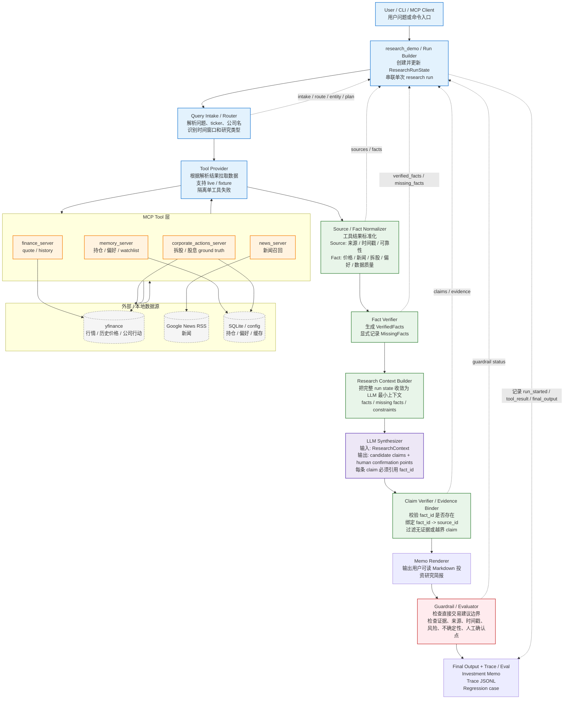

# 研究流水线架构图（F）— LLM Synthesizer 位置修正版

> 用途：用 flowchart 说明当前 Investment Agent 的 P1 research pipeline 总体架构。
> 箭头含义：单次研究任务中的执行顺序和数据转换方向；不表示代码 import 依赖、服务部署依赖或多 agent 调度。

---

## Mermaid 源码



---

## 读图说明

这张图强调当前项目的主链路是：

```text
用户问题
-> 问题解析
-> 工具取数
-> Source / Fact 标准化
-> Fact 核验与缺口记录
-> ResearchContext 最小上下文
-> LLM Synthesizer 生成 candidate claims
-> Claim / Evidence 绑定
-> Memo 渲染
-> Guardrail 检查
-> Final Memo + Trace / Eval
```

每个节点的作用如下：

- `User / CLI / MCP Client`：用户从本地 CLI、Claude Desktop、Claude Code 或其他 MCP client 发起研究问题。
- `research_demo / Run Builder`：当前单次研究任务的入口控制代码，创建并更新 `ResearchRunState`，串联各模块。
- `Query Intake / Router`：把自然语言问题转成可执行的标的、意图、时间窗口和研究计划。
- `Tool Provider`：根据解析结果拉取行情、新闻、偏好和公司行动数据。
- `MCP Tool 层`：封装实际工具能力，不承担最终研究判断。
- `外部 / 本地数据源`：提供原始事实来源，包括 yfinance、Google News RSS、SQLite 和 config。
- `Source / Fact Normalizer`：把原始工具结果转成带来源、时间戳和可靠性的结构化事实。
- `Fact Verifier`：区分已核验事实和缺失事实，避免把缺口当结论。
- `Research Context Builder`：把完整状态收敛成 LLM 可见的最小上下文，减少越权读取和幻觉空间。
- `LLM Synthesizer`：只基于 `ResearchContext` 生成候选研究结论，不直接给交易指令。
- `Claim Verifier / Evidence Binder`：检查候选结论是否能绑定回 `fact_id` 和 `source_id`。
- `Memo Renderer`：把已绑定证据的研究状态渲染成用户可读报告。
- `Guardrail / Evaluator`：对最终用户可见文本做交易建议边界、证据、风险和来源检查。
- `Final Output + Trace / Eval`：输出研究 memo，并留下可回放 trace 和回归测试入口。

---

## 关键修正

- `LLM Synthesizer` 不再画在 Tool Provider 的并列分支上；它必须位于 `Source / Fact Normalizer`、`Fact Verifier` 和 `Research Context Builder` 之后。
- `Claim / Evidence Binder` 必须位于 `LLM Synthesizer` 之后，因为它处理的是 LLM 生成的 candidate claims。
- 当前图表达的是 **single-agent research pipeline**，不是 multi-agent orchestrator；编排对象是研究步骤和工具调用，不是多个 agent 角色。
- `ResearchRunState` 是贯穿流程的状态容器，因此在图中作为 `research_demo / Run Builder` 的维护对象出现，而不是独立服务节点。
