# UML 类图（G）— Investment Research Domain Model

> 用途：说明当前 P1 research loop 里核心数据模型、接口和实现类之间的关系。
> 边界：这张图描述的是源码中的 dataclass / protocol / runtime helper，不表示数据库 ER 图，也不表示多 agent 角色图。

---

## Mermaid 源码

```mermaid
classDiagram
    direction TB

    class ResearchRunState {
        +str run_id
        +str user_query
        +str started_at
        +str status
        +list~Source~ sources
        +list~Fact~ facts
        +list~Claim~ claims
        +list~VerifiedFact~ verified_facts
        +list~MissingFact~ missing_facts
        +ResearchContext research_context
        +GuardrailResult guardrail
        +str final_output
        +start(user_query) ResearchRunState
        +source_by_id(source_id) Source
        +fact_by_id(fact_id) Fact
    }

    class QueryIntake {
        +str raw_query
        +str normalized_query
        +str language
        +str requested_output
        +bool wants_direct_trading_advice
    }

    class IntentRoute {
        +str route
        +str rationale
    }

    class ResolvedEntity {
        +str raw_mention
        +str symbol
        +str company_query
        +str company_name
        +str confidence
    }

    class ResearchPlan {
        +list~FactNeed~ fact_needs
        +list~str~ output_sections
        +list~str~ boundary_notes
    }

    class FactNeed {
        +str key
        +str tool_name
        +str reason
        +bool required
    }

    class TimeWindow {
        +str label
        +str start_date
        +str end_date
        +str confidence
        +str rationale
    }

    class AttributionPlan {
        +str question_type
        +list~AttributionNeed~ needs
        +list~str~ peer_symbols
        +list~str~ index_symbols
    }

    class AttributionNeed {
        +str key
        +str description
        +bool required
    }

    class Source {
        +str id
        +str kind
        +str name
        +str fetched_at
        +str url
        +str tool_name
        +str raw_ref
        +str reliability
    }

    class Fact {
        +str id
        +str text
        +list~str~ source_ids
        +str observed_at
        +Any value
        +str metric
        +str symbol
    }

    class VerifiedFact {
        +str id
        +str fact_type
        +str text
        +list~str~ source_ids
        +str observed_at
        +str confidence
        +str verification_status
        +str raw_fact_id
        +Any value
    }

    class MissingFact {
        +str fact_type
        +str reason
        +bool required
    }

    class ResearchContext {
        +str user_query
        +ResolvedEntity entity
        +IntentRoute intent_route
        +TimeWindow time_window
        +AttributionPlan attribution_plan
        +list~ContextFact~ facts
        +list~ContextMissingFact~ missing_facts
        +list~str~ source_ids
        +list~ContextFact~ user_preferences
        +list~str~ unsupported_claim_constraints
    }

    class ContextFact {
        +str fact_id
        +str fact_type
        +str text
        +list~str~ source_ids
        +str observed_at
        +str confidence
        +str verification_status
        +Any value
    }

    class ContextMissingFact {
        +str fact_type
        +str reason
        +bool required
    }

    class CandidateClaim {
        +str text
        +str claim_type
        +list~str~ fact_ids
        +bool is_key
    }

    class SynthesisResult {
        +list~CandidateClaim~ claims
        +list~str~ human_confirmation_points
        +str raw_model_output
    }

    class Claim {
        +str id
        +str text
        +list~Evidence~ evidence
        +bool is_key
        +str claim_type
    }

    class Evidence {
        +str fact_id
        +str source_id
        +str quote
    }

    class ClaimVerificationResult {
        +bool passed
        +list~ClaimVerificationIssue~ issues
        +list~int~ accepted_claim_indexes
    }

    class ClaimVerificationIssue {
        +str claim_text
        +str issue_type
        +str message
        +str severity
        +list~str~ fact_ids
        +bool retrieval_needed
    }

    class GuardrailResult {
        +bool passed
        +list~PolicyCheck~ checks
    }

    class PolicyCheck {
        +str name
        +bool passed
        +str message
        +str severity
    }

    class RetrievalNeedPlan {
        +str user_query
        +list~RetrievalTask~ tasks
        +int issue_count
    }

    class RetrievalTask {
        +str fact_type
        +str issue_type
        +str query_focus
        +str priority
        +str reason
        +list~str~ candidate_tools
        +list~str~ source_requirements
        +list~str~ symbols
        +list~str~ fact_ids
        +str claim_text
    }

    class ToolResultBundle {
        +str data_source
        +dict preferences
        +dict quote
        +dict history
        +dict news
        +dict corporate_actions
    }

    class ToolResultProvider {
        <<Protocol>>
        +str data_source
        +fetch(symbol, company_query, history_days, news_days) ToolResultBundle
    }

    class FixtureToolResultProvider {
        +str data_source
        +fetch(symbol, company_query, history_days, news_days) ToolResultBundle
    }

    class LiveToolResultProvider {
        +str data_source
        +fetch(symbol, company_query, history_days, news_days) ToolResultBundle
    }

    class LLMResearchSynthesizer {
        <<Protocol>>
        +synthesize(run) SynthesisResult
    }

    class MockLLMResearchSynthesizer {
        +synthesize(run) SynthesisResult
    }

    class AnthropicJSONResearchSynthesizer {
        +str model
        +synthesize(run) SynthesisResult
    }

    ResearchRunState o-- QueryIntake : intake
    ResearchRunState o-- IntentRoute : intent_route
    ResearchRunState o-- ResolvedEntity : resolved_entity
    ResearchRunState o-- ResearchPlan : research_plan
    ResearchRunState o-- TimeWindow : time_window
    ResearchRunState o-- AttributionPlan : attribution_plan
    ResearchRunState o-- Source : sources
    ResearchRunState o-- Fact : facts
    ResearchRunState o-- VerifiedFact : verified_facts
    ResearchRunState o-- MissingFact : missing_facts
    ResearchRunState o-- ResearchContext : research_context
    ResearchRunState o-- Claim : claims
    ResearchRunState o-- ClaimVerificationResult : claim_verification
    ResearchRunState o-- GuardrailResult : guardrail
    ResearchRunState o-- RetrievalNeedPlan : retrieval_need_plan

    ResearchPlan o-- FactNeed : fact_needs
    AttributionPlan o-- AttributionNeed : needs

    Fact --> Source : source_ids
    VerifiedFact --> Fact : raw_fact_id
    VerifiedFact --> Source : source_ids

    ResearchContext o-- ContextFact : facts
    ResearchContext o-- ContextMissingFact : missing_facts
    ResearchContext --> ResolvedEntity : entity
    ResearchContext --> IntentRoute : intent_route
    ResearchContext --> TimeWindow : time_window
    ResearchContext --> AttributionPlan : attribution_plan

    SynthesisResult o-- CandidateClaim : claims
    CandidateClaim --> Fact : fact_ids

    Claim o-- Evidence : evidence
    Evidence --> Fact : fact_id
    Evidence --> Source : source_id

    ClaimVerificationResult o-- ClaimVerificationIssue : issues
    ClaimVerificationIssue --> Fact : fact_ids

    GuardrailResult o-- PolicyCheck : checks
    RetrievalNeedPlan o-- RetrievalTask : tasks
    RetrievalTask --> Fact : fact_ids

    ToolResultProvider <|.. FixtureToolResultProvider
    ToolResultProvider <|.. LiveToolResultProvider
    ToolResultProvider ..> ToolResultBundle : returns

    LLMResearchSynthesizer <|.. MockLLMResearchSynthesizer
    LLMResearchSynthesizer <|.. AnthropicJSONResearchSynthesizer
    LLMResearchSynthesizer ..> ResearchRunState : reads
    LLMResearchSynthesizer ..> SynthesisResult : returns
```

---

## 类图解读

这张类图分成三组：

1. **ResearchRunState 聚合的研究状态对象**
   - `ResearchRunState` 是单次 research run 的状态容器。
   - 它聚合入口解析结果、来源、事实、核验事实、缺失事实、研究上下文、claim、guardrail 和最终输出。
   - 它不是独立服务，也不是 agent；它是 `research_demo / Run Builder` 在执行过程中持续更新的数据对象。

2. **Source / Fact / Claim / Evidence 证据链模型**
   - `Source` 表示信息来自哪里，包含来源名称、工具名、时间戳和可靠性。
   - `Fact` 表示从 source 中标准化出来的事实。
   - `CandidateClaim` 是 LLM 生成的候选结论，必须引用 `fact_ids`。
   - `Claim` 是通过 verifier / binder 后进入最终 run state 的结论。
   - `Evidence` 把 `Claim` 绑定回 `Fact` 和 `Source`。

3. **Provider / Synthesizer 接口与实现**
   - `ToolResultProvider` 是工具结果提供接口，当前有 `FixtureToolResultProvider` 和 `LiveToolResultProvider` 两种实现。
   - `ToolResultBundle` 是工具层返回给 normalizer 的原始结果包。
   - `LLMResearchSynthesizer` 是综合接口，当前有 mock 和 Anthropic JSON 两种实现。
   - 当前真实 LLM 路径正在向“只读取 `ResearchContext`”收敛；类图中保留 `synthesize(run)` 是为了反映当前源码接口。

---

## 对应源码

| 类 / 接口 | 文件 |
|---|---|
| `ResearchRunState`, `Source`, `Fact`, `Claim`, `Evidence`, `ResearchContext` | `src/research/models.py` |
| `ToolResultProvider`, `ToolResultBundle`, `FixtureToolResultProvider`, `LiveToolResultProvider` | `src/research/tool_provider.py` |
| `LLMResearchSynthesizer`, `MockLLMResearchSynthesizer`, `AnthropicJSONResearchSynthesizer`, `SynthesisResult`, `CandidateClaim` | `src/research/synthesizer.py` |
| `evaluate_research_output`, `GuardrailResult`, `PolicyCheck` | `src/research/evaluator.py`, `src/research/models.py` |
| `verify_synthesis_claims`, `ClaimVerificationResult`, `ClaimVerificationIssue` | `src/research/claim_verifier.py`, `src/research/models.py` |

---

## 设计边界

- 这是数据模型与接口关系图，不是部署图。
- 当前项目没有多 agent 类继承结构；不要把 planner / researcher / critic 画成类，因为源码里没有这些 agent 类。
- `ResearchContext` 是 LLM 最小权限上下文，目标是避免 synthesizer 直接读取完整 run state 后引入未经核验的信息。
- `Evidence` 使用 `fact_id` 和 `source_id` 做引用绑定，而不是直接持有完整 `Fact` / `Source` 对象；这是为了 trace 和 JSON 序列化简单。
