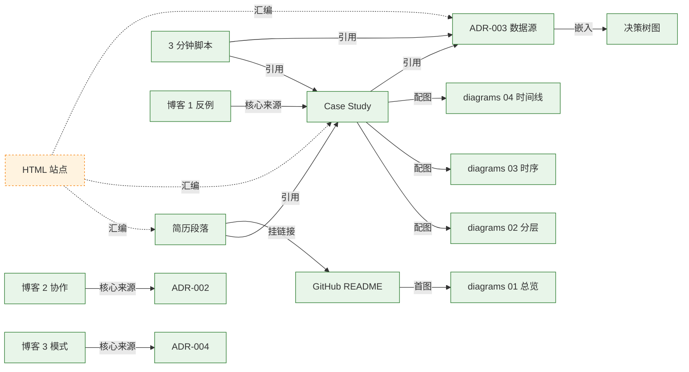

# Showcase 资产总览

> investment-agent 项目的**简历投递素材库**。一站式入口，按场景导航。
> 最后更新：2026-05-17

---

## 一句话定位

把 W1-W2 完成的工程成果（3 MCP Server 协作 + corporate_actions 反例闭环）**转化为可投递的多形态简历素材**。覆盖：简历段落、Case Study、架构图、ADR、口述脚本、技术博客。

---

## 场景导航 · 按受众

### HR / 招聘筛简历（10 秒决策）

| 场景 | 用什么 |
|---|---|
| 简历项目栏 | [resume-snippet.md](./resume-snippet.md) · 标准版 260 字 |
| 简历空间紧 | [resume-snippet.md](./resume-snippet.md) · 精简版 130 字 |
| LinkedIn headline / 自我介绍 | [resume-snippet.md](./resume-snippet.md) · 一句话版 50 字 |
| 邮件附带 | HTML 站点公开 URL（投递期补） |

### 技术一面（30-60 分钟）

| 场景 | 用什么 |
|---|---|
| 开场"介绍最近的项目" | [elevator-pitch-and-3min-script.md](./elevator-pitch-and-3min-script.md) · 1 分钟版 |
| "讲一个主导的项目" | 同上 · 3 分钟主版 |
| "你怎么解决幻觉" | [diagrams/02-knowledge-layering.md](./diagrams/02-knowledge-layering.md) + [ADR-004](./adr/004-knowledge-layering.md) |
| "Agent 真能自主调用工具？" | [diagrams/03-case-d-sequence.md](./diagrams/03-case-d-sequence.md) + [ADR-002](./adr/002-cross-server-no-orchestrator.md) |
| 高频追问预判（8 题） | [elevator-pitch-and-3min-script.md](./elevator-pitch-and-3min-script.md) · 备答库 |

### 终面（架构师 / 主导能力评估）

| 场景 | 用什么 |
|---|---|
| "你能主导技术决策？" | [diagrams/04-closed-loop-timeline.md](./diagrams/04-closed-loop-timeline.md) · 24h 闭环 |
| "为什么选 MCP 不选 LangChain？" | [ADR-001](./adr/001-why-mcp-not-langchain.md) |
| "为什么不让 LLM 联网搜？" | [ADR-003](./adr/003-corporate-actions-data-source.md) · 决策树 |
| "你考虑过哪些备选方案？" | [adr/](./adr/) 全部 5 篇都有 Alternatives Considered 段 |
| "你的工程方法论是什么？" | [ADR-004 知识分层](./adr/004-knowledge-layering.md) + [ADR-005 description vs inputSchema](./adr/005-description-vs-inputschema.md) |

### 公域 / 技术品牌

| 场景 | 用什么 |
|---|---|
| 反例叙事博客 | [blog/01-llm-knowledge-instability.md](./blog/01-llm-knowledge-instability.md) · 掘金首发 |
| 架构思考博客 | [blog/02-no-orchestrator.md](./blog/02-no-orchestrator.md) · 知乎首发 |
| 设计模式博客 | [blog/03-knowledge-layering-pattern.md](./blog/03-knowledge-layering-pattern.md) · 个人博客 |

---

## 资产矩阵 · 按形态

| 形态 | 文件 | 状态 |
|---|---|---|
| 📄 简历段落（3 版本） | [resume-snippet.md](./resume-snippet.md) | ✅ |
| 📄 一页纸 Case Study | [case-study-corporate-actions.md](./case-study-corporate-actions.md) | ✅ |
| 🎨 架构图集（4 张 Mermaid） | [diagrams/](./diagrams/) | ✅ |
| 📋 ADR 决策记录（5 篇） | [adr/](./adr/) | ✅ |
| 🎤 电梯演讲 + 3 分钟脚本 | [elevator-pitch-and-3min-script.md](./elevator-pitch-and-3min-script.md) | ✅ |
| ✍️ 技术博客（3 篇大纲） | [blog/](./blog/) | ✅ 大纲完成 · 🔲 展开成稿（按 W4/W5/W6 节奏） |
| 🌐 HTML 站点 | MkDocs Material | 🔲 W4 收尾日 1 启动 |

---

## 投递时间线

| 时点 | 动作 | 依赖资产 |
|---|---|---|
| 2026-05-17 ★ | showcase 9 类素材沉淀完成 | 本目录 |
| 2026-05-25 ~ 31 | W4 投资 Agent MVP 完成 | （工程） |
| 2026-05-31 | 第 1 篇博客发布（反例闭环） | blog/01 |
| 2026-06-08 | 第 2 篇博客发布（无 orchestrator） | blog/02 |
| 2026-06-28 | 第 3 篇博客发布（知识分层模式） | blog/03 |
| 2026-07-06 ★ | **投递期启动** | 全套资产 |

---

## 三道防线 · 简历可信度

| 防线 | 资产 | 防什么 |
|---|---|---|
| 第 1 道 | 简历段落 + Case Study | 防 HR/一面快筛漏掉 |
| 第 2 道 | 架构图 + ADR + 备答库 | 防技术面追问被问倒 |
| 第 3 道 | 博客 + HTML 站点 URL + GitHub 仓库 | 防"你是不是编的"质疑 |

任何一道单独都不够强；三道叠加构成不可质疑的反例闭环叙事。

---

## 剩余 TODO（按优先级）

| 优先级 | 任务 | 投入 |
|---|---|---|
| 🥇 P0 | HTML 站点搭建（MkDocs Material） | 1-2 h |
| 🥉 P2 | 博客 3 篇按节奏展开成稿 | 每篇 1 天，W4-W6 阶梯发 |
| 🥉 P2 | GitHub 公开仓库 + README 链接生效 | 30 min |

---

## 资产间的依赖关系

---

## 维护原则

- **数据有变化即更新**：W3-W6 推进时，新增量化数据要同步回 resume-snippet / case-study
- **关键词清单同步**：W5 上下文工程、W6 记忆系统完成后，把对应关键词从 resume-snippet 的 ⚠️ 移到 ✅
- **博客发布后回链**：发布的博客 URL 回填到 resume-snippet "投递配套素材链接"段
- **HTML 站点单一真理源**：所有页面来自现有 Markdown，内容变更通过 push 自动同步，不重复维护
